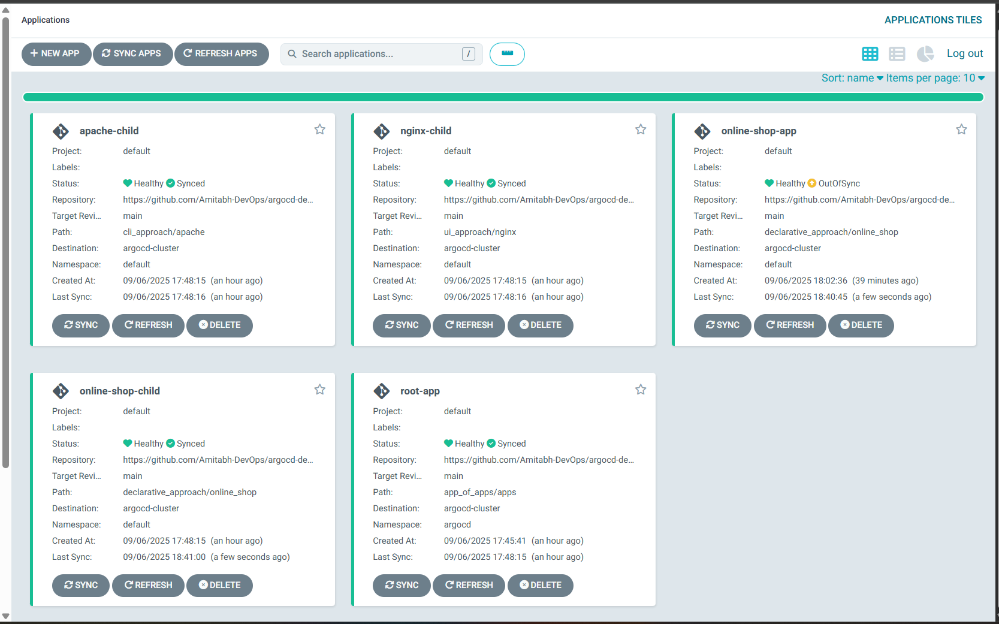
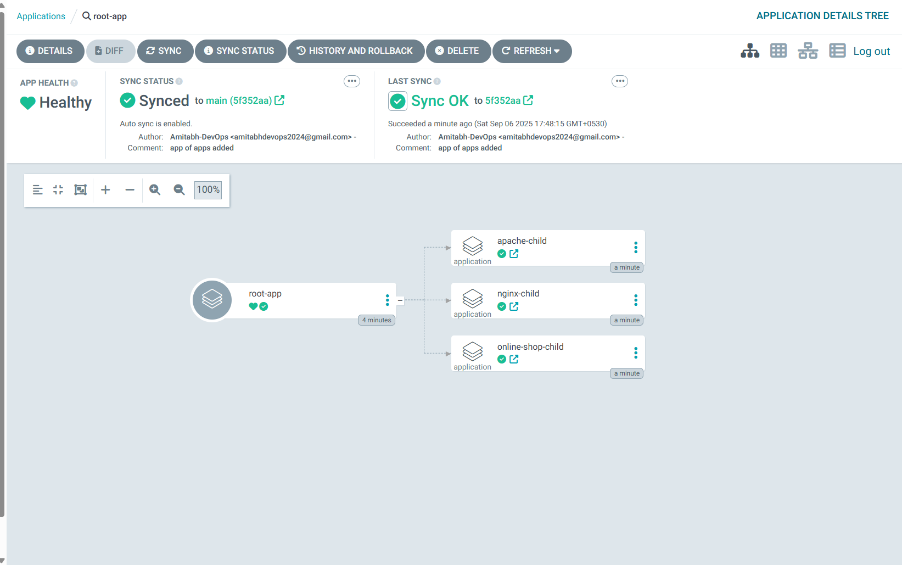
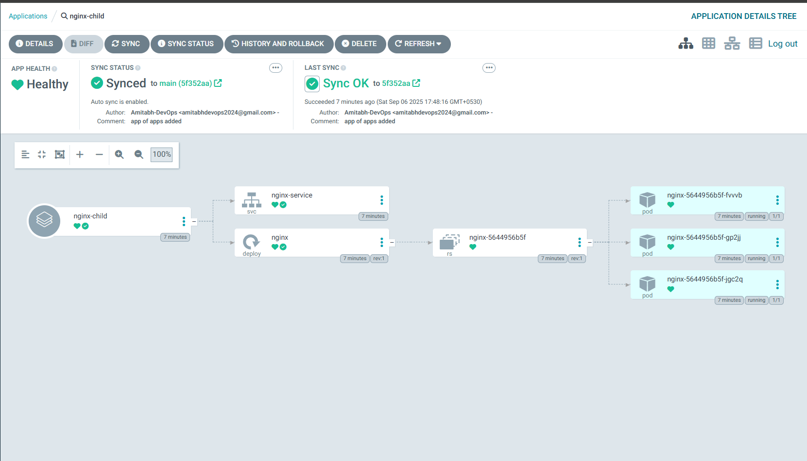
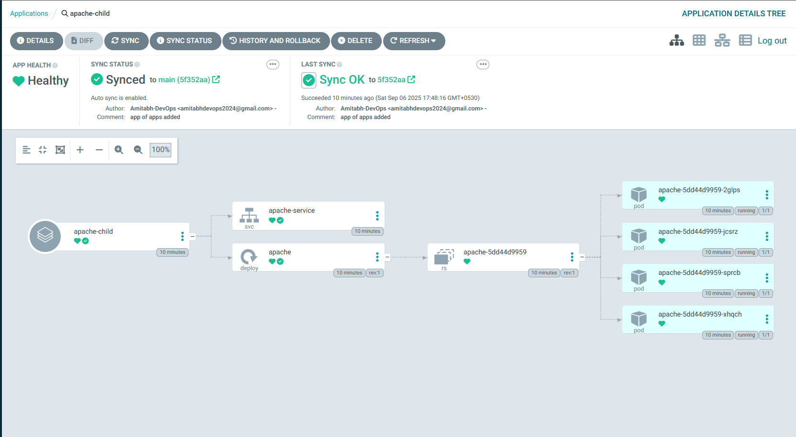
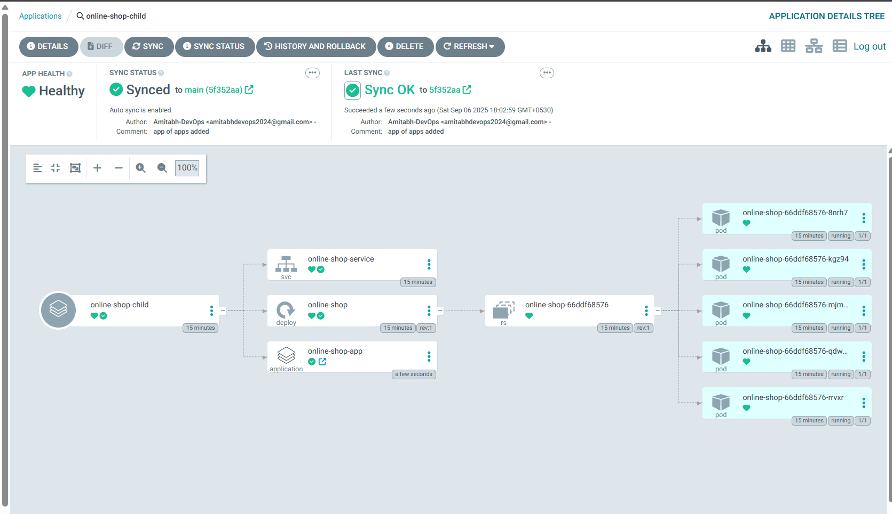
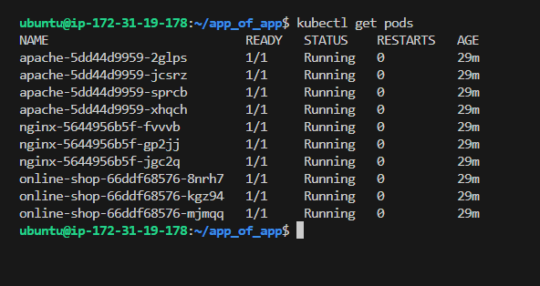
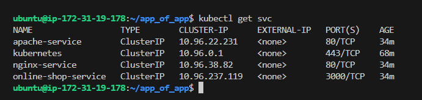
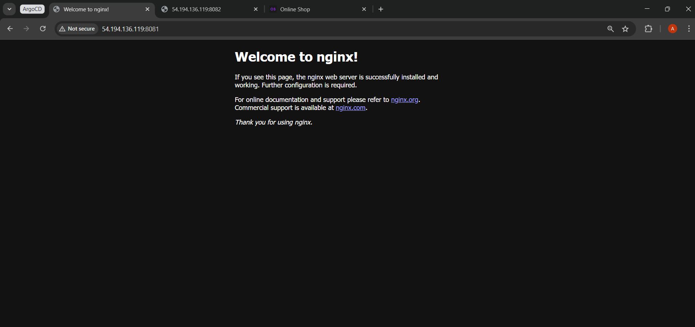
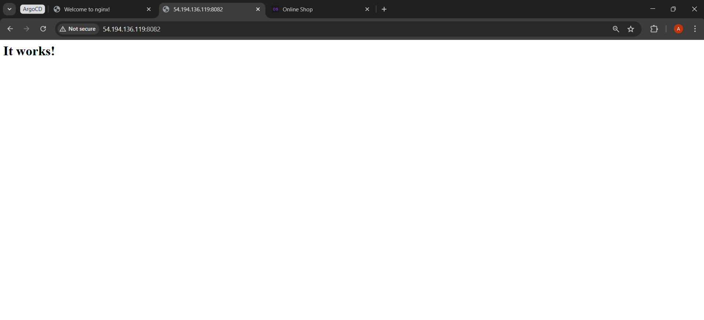
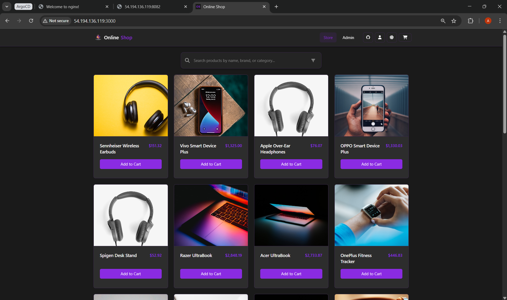

# App of Apps Pattern in ArgoCD

In this section, we’ll explore the **App of Apps pattern**, a powerful technique for managing multiple applications in ArgoCD using a single **root application**.

---

##  App of Apps Pattern

- Normally, you create one `Application` CRD per app.  
- But in large setups, you may need to manage **dozens of apps**.  
- The **App of Apps pattern** solves this by:
  - Defining one **root application**.
  - That root application points to a directory in Git that contains **child Application manifests**.
  - ArgoCD syncs the root → which then creates child apps automatically.

✅ Benefits:
- One entry point → manage many apps together.
- DRY (Don’t Repeat Yourself) → structure is reusable.
- Easy onboarding for new teams.
- Great for platform teams → one “platform repo” holds all app definitions.

---

##  Steps to Apply App of Apps Pattern

### Prerequiste
* ArgoCD installed and running.
* `argocd` CLI installed and configured.
* A kind cluster added to ArgoCD (as we done till now)

> Follow this guide to set up ArgoCD: [ArgoCD Setup & Installation](../../03_setup_installation/README.md)


### 1. Review the Root Application

**root_app.yml** defines the parent application:

Use [root_app.yml](root_app.yml)

Replace `<your-username>` with your GitHub username.

Replace `<argocd_cluster_server_url>` with your ArgoCD added cluster server URL, you can retrive it using command `argocd cluster list`

> [!IMPORTANT]
>
> And also Replace `server: https://172.31.19.178:33893` in `argocd-demos` repos - `app_of_apps/apps` (apache_app.yml, nginx_app.yml, online_shop_app.yml) with your ArgoCD Cluster Url and Commit & Push it, You can get it by running `argocd cluster list`

---

### 2. Apply the Root Application

Create the `root_app.yml` file by adding required Application CRD manifest and apply:

```bash
kubectl apply -f root_app.yml -n argocd
```

---

### 3. Verify in ArgoCD UI

* Go to **ArgoCD UI → Applications**.
* You’ll see `root-app`.
    
    

    

* Expanding it will show the **child apps**:

  * nginx-child

      

  * apache-child

      

  * online-shop-child   

      

---

### 4. Verify in CLI

```bash
argocd app list
```

You should see all child apps managed under `root-app`.

```bash

NAME                      CLUSTER                      NAMESPACE  PROJECT  STATUS     HEALTH   SYNCPOLICY  CONDITIONS                REPO                                                PATH                              TARGET
argocd/apache-child       https://172.31.19.178:33893  default    default  Synced     Healthy  Auto-Prune  <none>                    https://github.com/Amitabh-DevOps/argocd-demos.git  cli_approach/apache               main
argocd/nginx-child        https://172.31.19.178:33893  default    default  Synced     Healthy  Auto-Prune  <none>                    https://github.com/Amitabh-DevOps/argocd-demos.git  ui_approach/nginx                 main
argocd/online-shop-app    https://172.31.19.178:33893  default    default  Synced     Healthy  Auto-Prune  <none>                    https://github.com/Amitabh-DevOps/argocd-demos.git  declarative_approach/online_shop  main
argocd/online-shop-child  https://172.31.19.178:33893  default    default  OutOfSync  Healthy  Auto-Prune  SharedResourceWarning(3)  https://github.com/Amitabh-DevOps/argocd-demos.git  declarative_approach/online_shop  main
argocd/root-app           https://172.31.19.178:33893  argocd     default  Synced     Healthy  Auto-Prune  <none>                    https://github.com/Amitabh-DevOps/argocd-demos.git  app_of_apps/apps
```

> Note `online-shop-app` is created because in `argocd-demos` repo we already have Appliation CRD for online-shop in declarative approach, that's why with the help of true gitops it created that also.

---

### 5. Test the Sync

* Make a Git change to any child app manifest (e.g., scale replicas).
* Commit & push.
* Sync `root-app` → it will propagate changes to all child apps.

I have changed the replicas of `online-shop` deployment from 5 to 3 and it works:

  

---

## Access all application

Run this command to see all child app pods:

```bash
kubectl get pods
```

You should see pods for all three apps:

  


Run this command to get services running:
```bash
kubectl get svc
```

You should see services for all three child:

  

---

Now, we will port-forward each service to access the apps locally.

### 1. Nginx app

```bash
kubectl port-forward svc/nginx-service 8081:80 --address=0.0.0.0 &
```

Open the inbound rule for port 8081 and access the Nginx app at: http://<instance_public_ip>:8081

  

---

### 2. Apache app

```bash
kubectl port-forward svc/apache-service 8082:80 --address=0.0.0.0 &
```

Open the inbound rule for port 8082 and access the Apache app at: http://<instance_public_ip>:8082

  

---
### 3. Online shop app

```bash
kubectl port-forward svc/online-shop-service 3000:3000 --address=0.0.0.0 &
```

Open the inbound rule for port 3000 and access the Online Shop app at: http://<instance_public_ip>:3000

  

---

##  Key Takeaways

* App of Apps = **root application** managing multiple **child apps**.
* Great for platform teams managing many apps at once.
* Best practice: keep root app in a **separate “platform repo”** while child apps live in team repos.

---

Happy Learning!