# ApplicationSets in ArgoCD

**ApplicationSets** are a way to dynamically generate multiple ArgoCD Applications from a single manifest.  
Instead of writing many `Application` YAMLs, you define a template + a generator, and ArgoCD creates the apps for you.

---

## Theory

- Normally, each app = one `Application` CRD.  
- With **ApplicationSets**, you can generate many apps automatically.  
- Generators decide **how apps are created**:
  - **List Generator** → define a static list of apps.  
  - **Cluster Generator** → deploy the same app across multiple clusters.  
  - **Git Generator** → scan a repo and create an app per folder.  

✅ Benefits:  
- Less YAML to maintain.  
- Easier multi-cluster & multi-env deployments.  
- True DRY (Don’t Repeat Yourself).  

---

## Examples

### 1. List Generator (Multiple Apps)

**list_generator.yml** :

Use: [list_generator.yml](list_generator.yml)

> Replace `<your-username>` with your GitHub username.

This will create two apps:

* `nginx-list` → nginx app.
* `online-shop-list` → online-shop app.
* `chaiapp-list` → chai app.

---

### 3. Git Generator (Apps from Folders in Repo)

**git_generator.yml** :

Use: [git_generator.yml](git_generator.yml)

> Replace `<your-username>` with your GitHub username.

This will scan repo directories and auto-create apps for each folder found.

---

### 3. Cluster Generator (Same App in Multiple Clusters)

**cluster_generator.yml** :

Use: [cluster_generator.yml](cluster_generator.yml)

> Replace `<your-username>` with your GitHub username.

This will deploy **chai-app** into **all clusters** registered in ArgoCD.

---

## Steps to Use

## 1. List-generator

### Prerequisite
- kind cluster running (Where argocd is deployed).
- ArgoCD installed and running.
- `argocd` CLI installed and logged in.
- `kubectl` CLI installed and configured.

1. Apply `list_generator` ApplicationSet manifests:

    ```bash
    kubectl apply -f list_generator.yml -n argocd
    ```

    Run `argocd appset list`:

    ```bash
    NAME              PROJECT  SYNCPOLICY  CONDITIONS                                                                                                                                                                                                                                     REPO                                                PATH      TARGET
    argocd/demo-list  default  nil         [{ParametersGenerated Successfully generated parameters for all Applications 2025-09-08 09:33:30 +0000 UTC True ParametersGenerated} {ResourcesUpToDate ApplicationSet up to date 2025-09-08 09:33:30 +0000 UTC True ApplicationSetUpToDate}]  https://github.com/Amitabh-DevOps/argocd-demos.git  {{path}}  main
    ```

2. Verify in ArgoCD UI:

    * Apps will appear automatically (e.g., `nginx-list`, `online-shop-list`, `chaiapp-list`).

        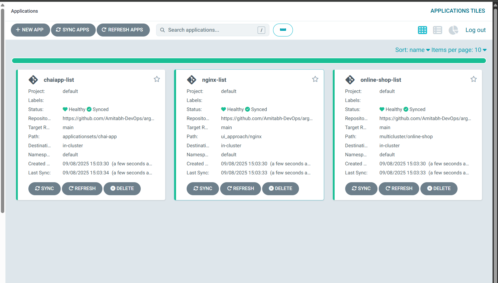

    * `nginx-list` :

        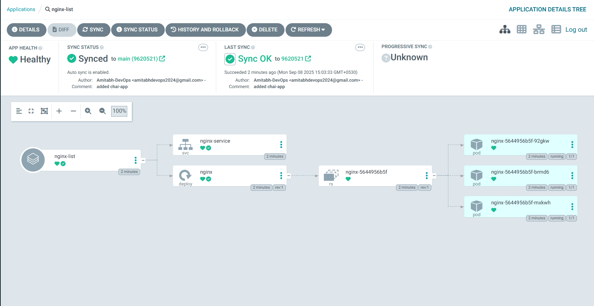

    * `online-shop-list` :

        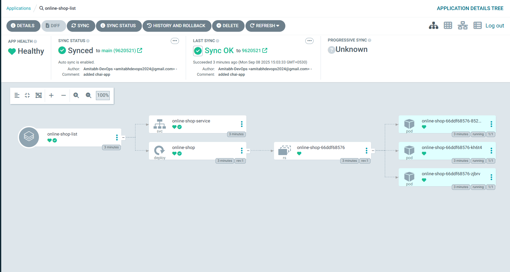

    * `chaiapp-list` :

        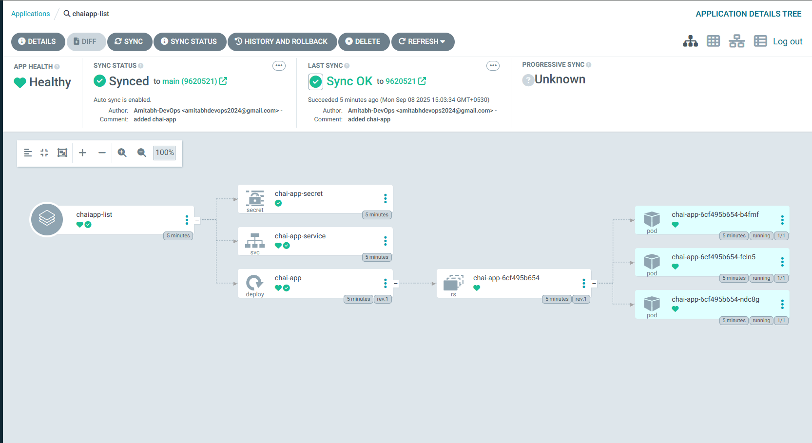

3. Verify in CLI:

    ```bash
    argocd app list
    ```

    You will get something like: 

    ```bash
    NAME                     CLUSTER                         NAMESPACE  PROJECT  STATUS  HEALTH   SYNCPOLICY  CONDITIONS  REPO                                                PATH                      TARGET
    argocd/chaiapp-list      https://kubernetes.default.svc  default    default  Synced  Healthy  Auto-Prune  <none>      https://github.com/Amitabh-DevOps/argocd-demos.git  applicationsets/chai-app  main
    argocd/nginx-list        https://kubernetes.default.svc  default    default  Synced  Healthy  Auto-Prune  <none>      https://github.com/Amitabh-DevOps/argocd-demos.git  ui_approach/nginx         main
    argocd/online-shop-list  https://kubernetes.default.svc  default    default  Synced  Healthy  Auto-Prune  <none>      https://github.com/Amitabh-DevOps/argocd-demos.git  multicluster/online-shop  main
    ```

4. Access the application

    * Nginx:

        ```bash
        kubectl port-forward svc/nginx-service 8081:80 --address=0.0.0.0 &
        ```

        Open inbound rule for port `8081` & then open browser and access: `http://localhost:8081`

        * You should see Nginx welcome page.
            
            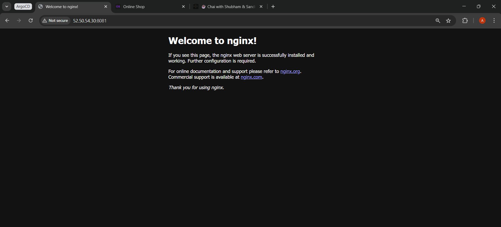

    * Online-Shop:

        ```bash
        kubectl port-forward svc/online-shop-service 3000:3000 --address=0.0.0.0 &
        ```
        
        Open inbound rule for port `3000` & then open browser and access: `http://localhost:3000`
    
        * You should see Online-Shop homepage.
            
            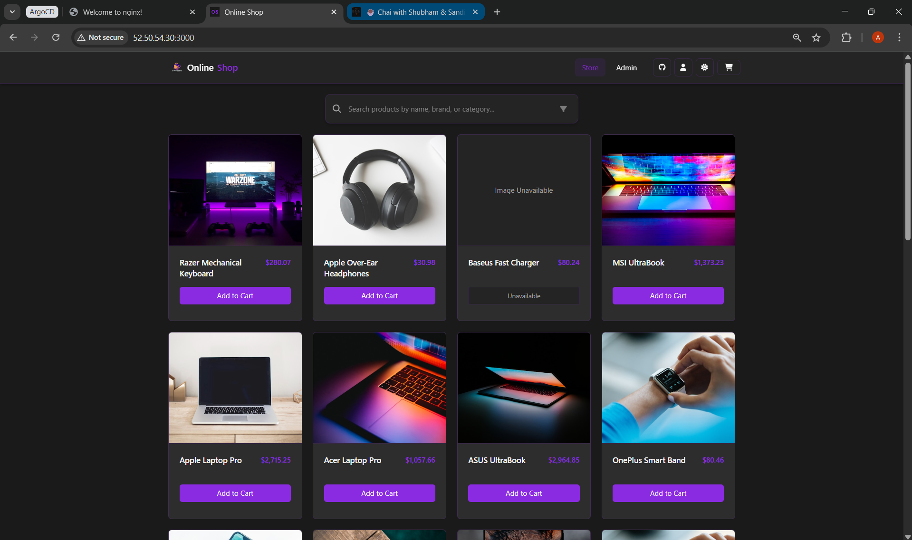

    * Chai-App

        ```bash
        kubectl port-forward svc/chai-app-service 3001:3000 --address=0.0.0.0 &
        ```
        
        Open inbound rule for port `3001` & then open browser and access: `http://localhost:3001`
    
        * You should see Chai-App and Use it chat with `Shubham Londhe`, `Sandip Das` and `Amitabh Soni`.
            
            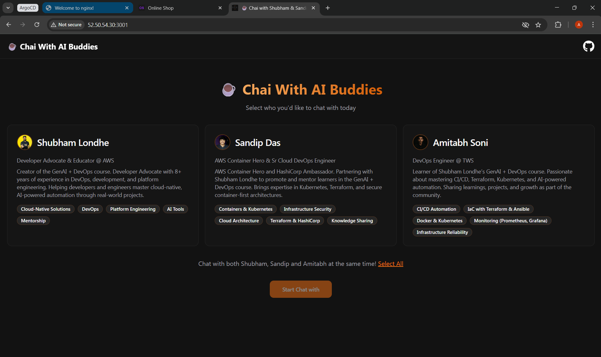

            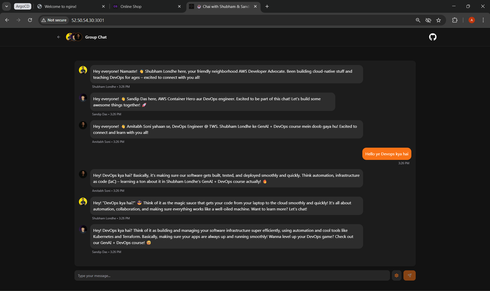

5. Delete ApplicationSet:

    ```bash
    argocd appset delete argocd/demo-list
    ```

---

## 2. Cluster-generator

### Prerequisite
- kind cluster running (Where argocd is deployed).
- ArgoCD installed and running.
- `argocd` CLI installed and logged in.
- `kubectl` CLI installed and configured.
- At least 2 clusters registered in ArgoCD (e.g., Dev, Stg, Prod).

For now, we will use `in-cluster` and `argocd-cluster`(Where ArgoCD is deployed):

1. Get you `argocd-cluster` context:

    ```bash
    kubectl config get-contexts
    ```

2. Add it to ArgoCD Cluster:

    ```bash
    argocd cluster add kind-argocd-cluster 
    ```

    > Note: You can add any other cluster too.

3. Verify in ArgoCD Server:

    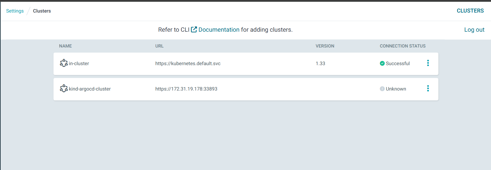

---

1. Apply `cluster_generator` ApplicationSet manifests:

    ```bash
    kubectl apply -f cluster_generator.yml -n argocd
    ```

    Run `argocd appset list`:

    ```bash
    NAME                 PROJECT  SYNCPOLICY  CONDITIONS                                                                                                                                 
                                                                                                        REPO                                                PATH                      TARGET
    argocd/demo-cluster  default  nil         [{ParametersGenerated Successfully generated parameters for all Applications 2025-09-08 10:26:24 +0000 UTC True ParametersGenerated} {ResourcesUpToDate ApplicationSet up to date 2025-09-08 10:26:24 +0000 UTC True ApplicationSetUpToDate}]  https://github.com/Amitabh-DevOps/argocd-demos.git  applicationsets/chai-app  main
    ```

2. Verify in ArgoCD UI:

    * Apps will appear automatically (e.g., `chai-app` deployed to all clusters such as `in-cluster` and `kind-argocd-cluster`).

        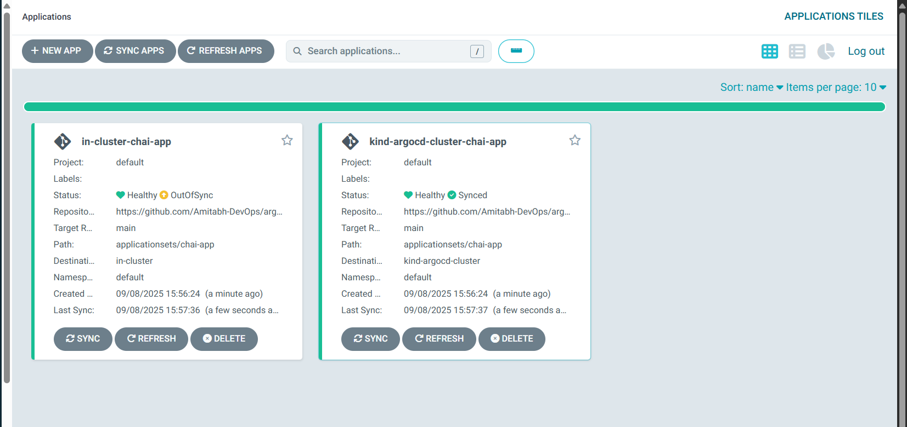

3. Verify in CLI:

    ```bash
    argocd app list
    ```

    You will get:

    ```bash
    NAME                                 CLUSTER                         NAMESPACE  PROJECT  STATUS     HEALTH   SYNCPOLICY  CONDITIONS                REPO                                                PATH                      TARGET
    argocd/in-cluster-chai-app           https://kubernetes.default.svc  default    default  OutOfSync  Healthy  Auto-Prune  SharedResourceWarning(3)  https://github.com/Amitabh-DevOps/argocd-demos.git  applicationsets/chai-app  main
    argocd/kind-argocd-cluster-chai-app  https://172.31.19.178:33893     default    default  Synced     Healthy  Auto-Prune  <none>                    https://github.com/Amitabh-DevOps/argocd-demos.git  applicationsets/chai-app  main
    ```

> [!NOTE]
>
> The `in-cluster` app is `OutOfSync` because the `chai-app` is also deployed to `kind-argocd-cluster` and using same resources, it is just a warning - ignore it.

4. Access the application

    * Chai-App in `kind-argocd-cluster`:

        ```bash
        kubectl port-forward --context kind-argocd-cluster svc/chai-app-service 3002:3000 --address=0.0.0.0 &
        ```

    * Access it in browser:

        Open inbound rule for port `3002`(as we have used `3001` previously) & then open browser and access: `http://localhost:3002`
    
        * You should see Chai-App and Use it chat with `Shubham Londhe`, `Sandip Das` and `Amitabh Soni`.
            
            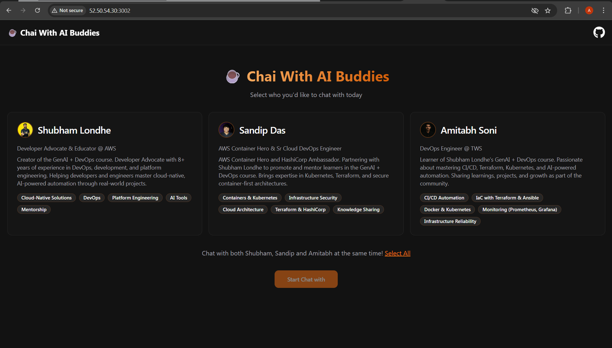

            


5. Delete ApplicationSet:

    ```bash
    argocd appset delete argocd/demo-cluster
    ```

---

## 3. Git-generator

### Prerequisite
- kind cluster running (Where argocd is deployed).
- ArgoCD installed and running.
- `argocd` CLI installed and logged in.
- `kubectl` CLI installed and configured.
- A GitHub repo with multiple app folders (e.g., nginx, apache, online-shop, chai-app).
- Replace `<your-username>` in the manifest with your actual GitHub username.

1. Apply `git_generator` ApplicationSet manifests:

    ```bash
    kubectl apply -f git_generator.yml -n argocd
    ```

    Run `argocd appset list`:

    ```bash
    NAME             PROJECT  SYNCPOLICY  CONDITIONS                                                                                                                                     
                                                                                                    REPO                                                PATH      TARGET
    argocd/demo-git  default  nil         [{ParametersGenerated Successfully generated parameters for all Applications 2025-09-08 11:04:06 +0000 UTC True ParametersGenerated} {ResourcesUpToDate ApplicationSet up to date 2025-09-08 11:04:06 +0000 UTC True ApplicationSetUpToDate}]  https://github.com/Amitabh-DevOps/argocd-demos.git  {{path}}  main
    ```

2. Verify in ArgoCD UI:

    * Apps will appear automatically (e.g., `apache`, `online-shop`, `chai-app`).

        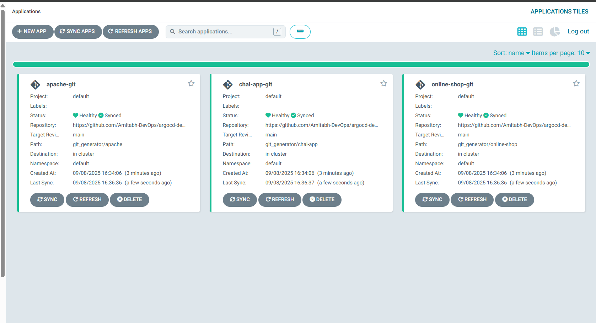

3. Verify in CLI:

    ```bash
    argocd app list
    ```

    ```bash
    NAME                    CLUSTER                         NAMESPACE  PROJECT  STATUS  HEALTH   SYNCPOLICY  CONDITIONS  REPO                                                PATH                       TARGET
    argocd/apache-git       https://kubernetes.default.svc  default    default  Synced  Healthy  Auto-Prune  <none>      https://github.com/Amitabh-DevOps/argocd-demos.git  git_generator/apache       main
    argocd/chai-app-git     https://kubernetes.default.svc  default    default  Synced  Healthy  Auto-Prune  <none>      https://github.com/Amitabh-DevOps/argocd-demos.git  git_generator/chai-app     main
    argocd/online-shop-git  https://kubernetes.default.svc  default    default  Synced  Healthy  Auto-Prune  <none>      https://github.com/Amitabh-DevOps/argocd-demos.git  git_generator/online-shop  main
    ```

4. Access the application
    
    Now to try to get the `services`(kubectl get svc -n default) of `deployment` and forward it and access the application or you can use from above applicationsets.

    1. Apache:

        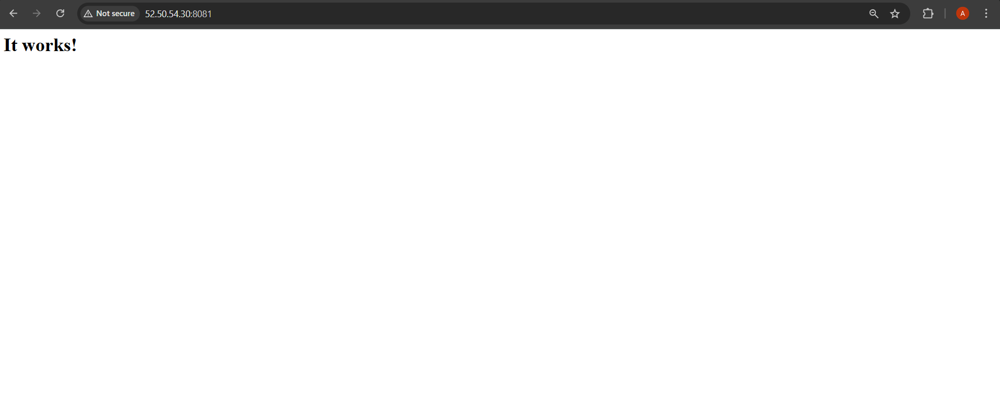

    2. Online-Shop:

        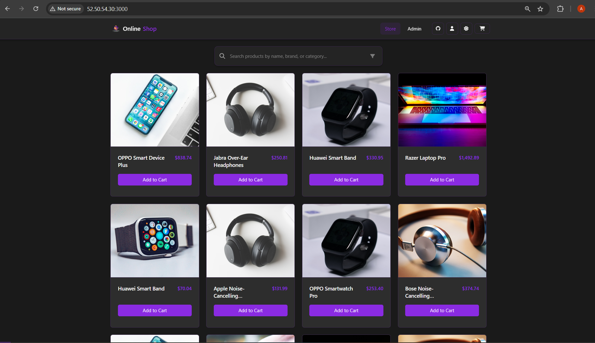

    3. Chai-App:

        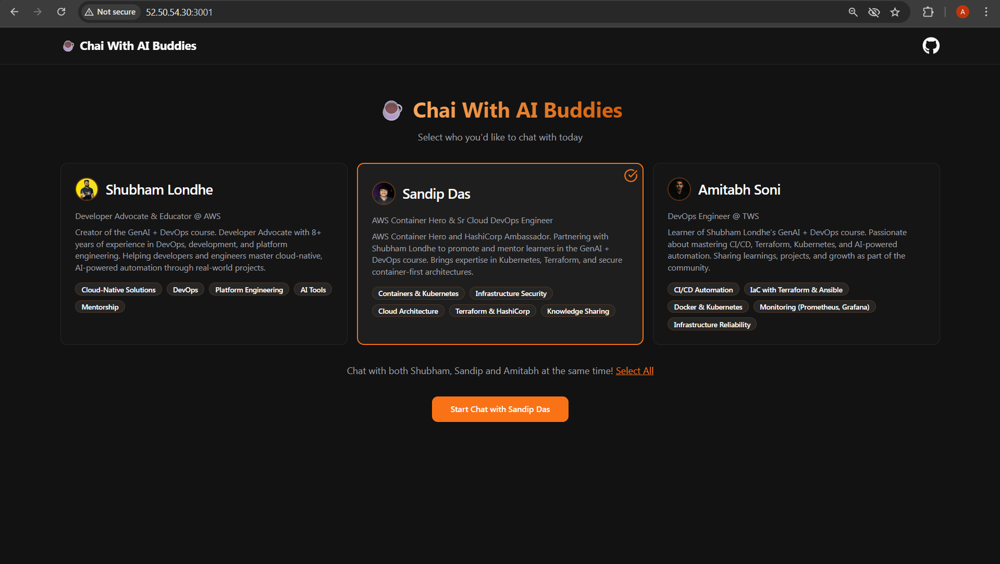

        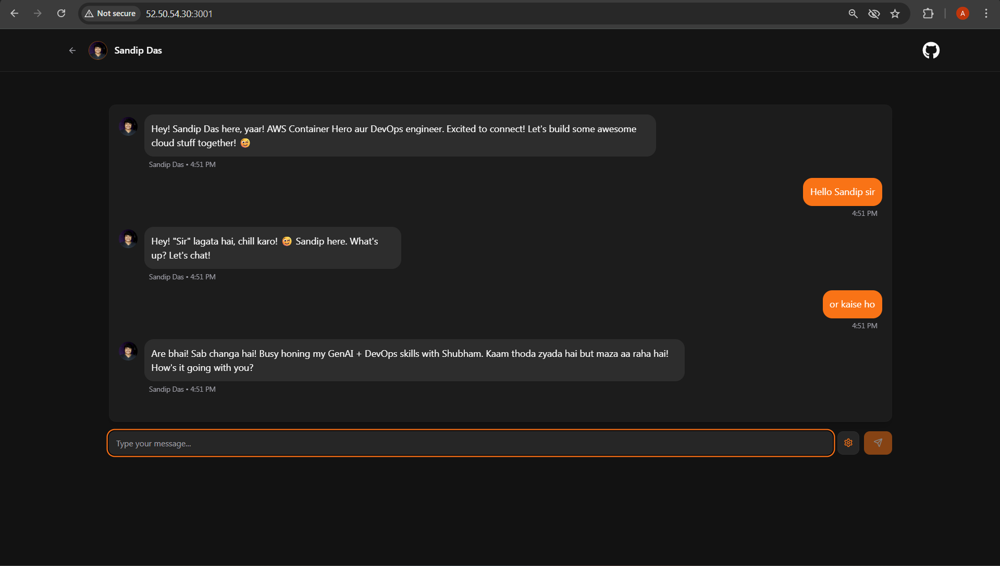

5. Delete ApplicationSet:

    ```bash
    argocd appset delete argocd/demo-git
    ```
---

## Comparison of Generators

| Generator Type        | How it Works                                                            | Best Use Case                                                           | Example Outcome                                                        |
| --------------------- | ----------------------------------------------------------------------- | ----------------------------------------------------------------------- | ---------------------------------------------------------------------- |
| **List Generator**    | You define a static list of apps (name + path).                         | Simple multi-app deployments where the set of apps is known in advance. | `nginx-list`, `apache-list` and `chaiapp-list` created from a single manifest.            |
| **Cluster Generator** | Iterates over all clusters registered in ArgoCD (`argocd cluster add`). | Deploying the same app across multiple clusters (e.g., Dev, Stg, Prod). | Chai-App automatically deployed to all clusters.                    |
| **Git Generator**     | Scans Git repo for folders or manifests, creates an app per folder.     | Microservices or monorepos where each folder = one app.                 | Apps auto-created for `git_generator/apache`, `git_generator/online-shop` and `git_generator/chai-app`, etc. |


---

##  Key Takeaways

* **ApplicationSet** = one manifest → many apps.
* Generators control how apps are created (List, Cluster, Git).
* Very useful for **multi-cluster + multi-env** deployments.
* Reduces YAML duplication and simplifies GitOps workflows.

For more info read: [ApplicationSet](https://argo-cd.readthedocs.io/en/stable/operator-manual/applicationset/)

---

Happy Learning!
