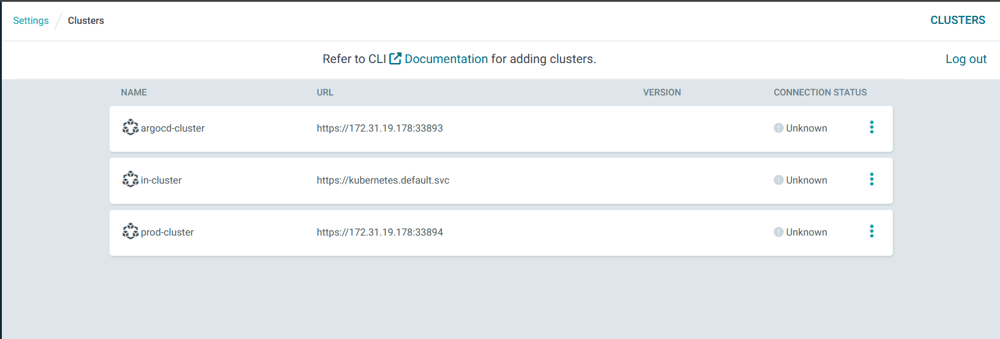
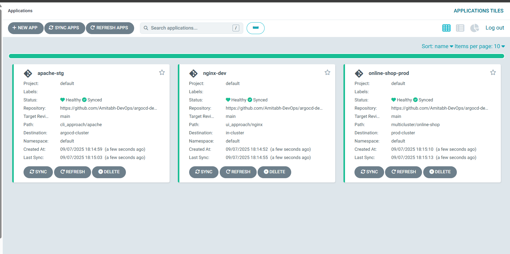
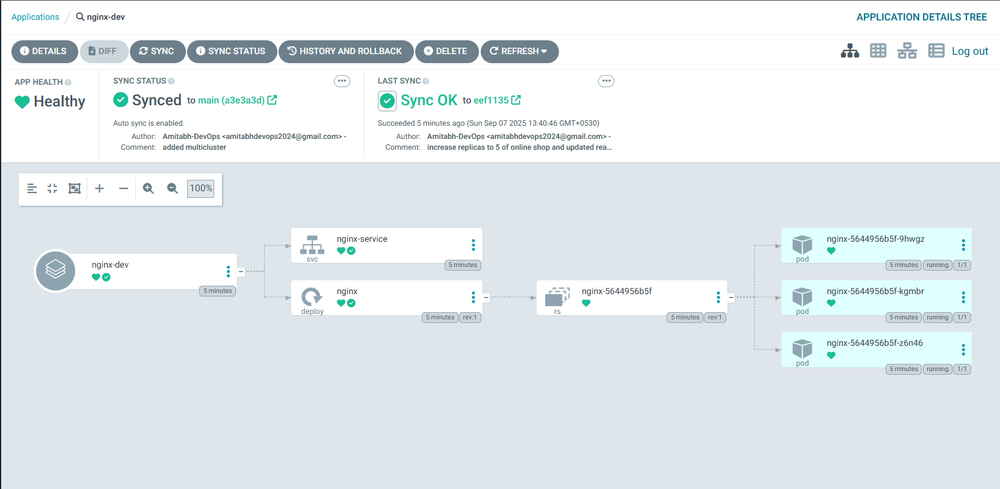
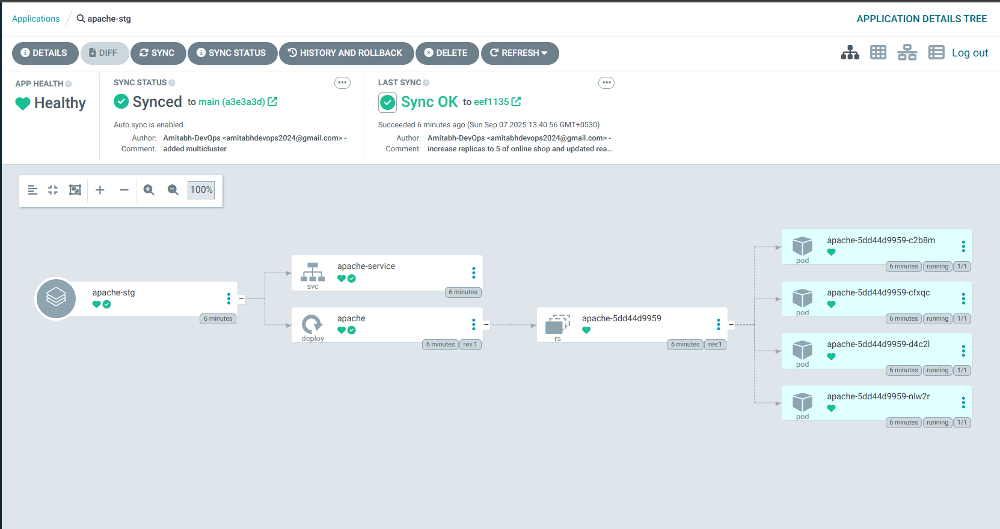
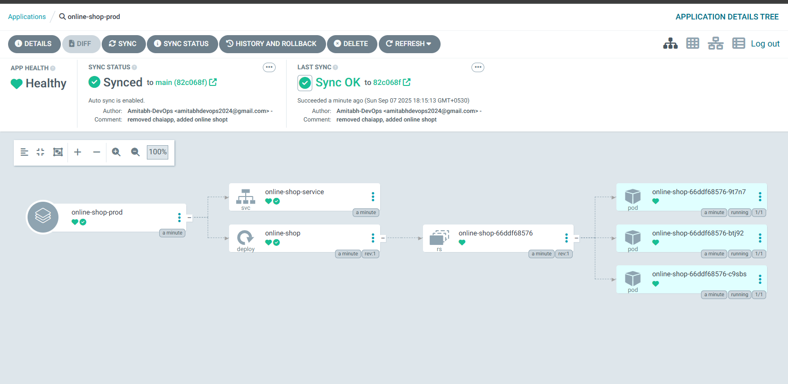
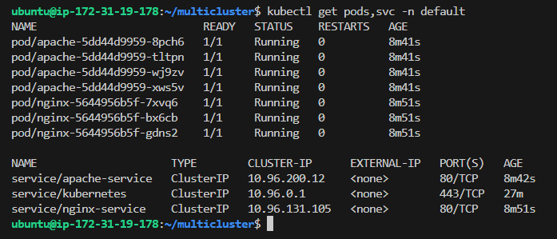
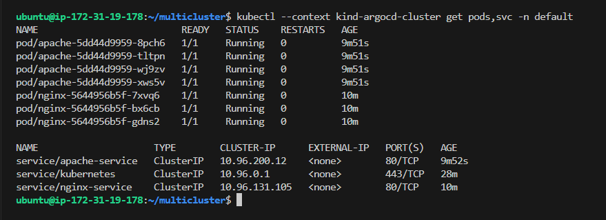
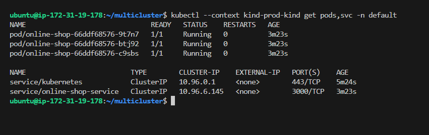
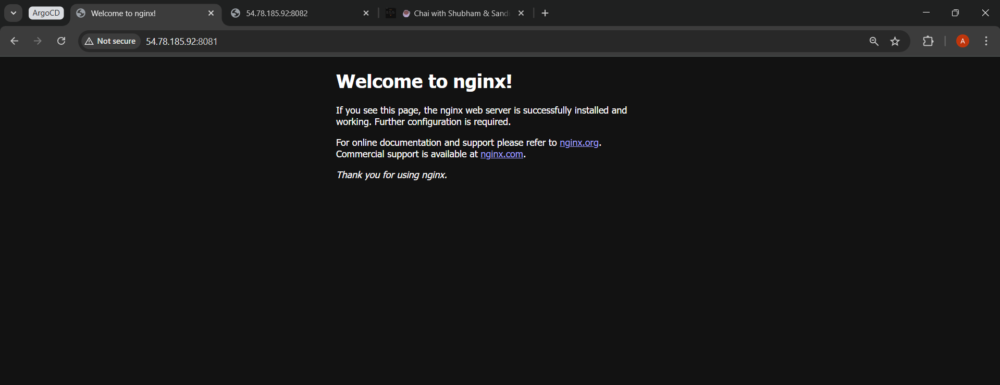
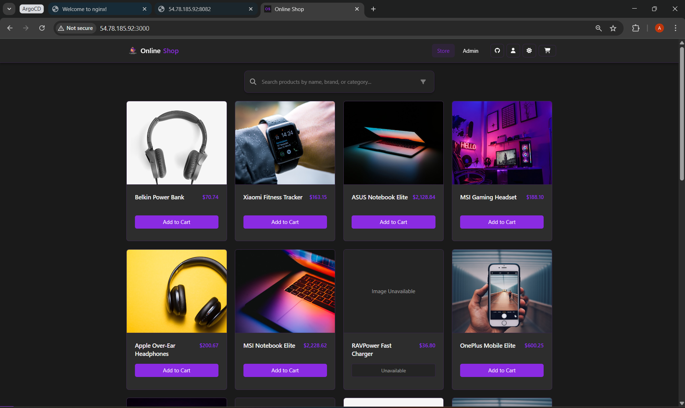

# Multi-Cluster Management with ArgoCD

In this section, we’ll learn how ArgoCD can manage **multiple Kubernetes clusters** from a single control plane.  

We’ll create:  
- **prod-kind** → Production cluster (we will deploy Online-shop here)

The control plane (ArgoCD server) will run in **kind-argocd-cluster**.
And we will use like:
- **in-cluster** → Dev cluster (we will deploy nginx app here)
- **argocd-cluster** → Staging cluster (we will deploy apache app here)
- **prod-kind** → Production cluster (we will deploy Online-shop here)

---

## Theory

- By default, ArgoCD manages only the cluster where it is installed (`in-cluster`).  
- By adding more clusters with `argocd cluster add`, ArgoCD can deploy apps into **multiple target clusters**.  
- This is how enterprises manage **Dev → Stage → Prod** from a single GitOps control plane.  

✅ Benefits:  
- One ArgoCD instance → many clusters.  
- Centralized GitOps workflows.  
- Easier governance and promotion of apps across environments.  

---

##  Steps

### Prerequisite
- kind cluster running (Where argocd is deployed).
- ArgoCD installed and running.
- `argocd` CLI installed and logged in.
- `kubectl` CLI installed and configured.

> Follow this guide to set up ArgoCD: [ArgoCD Setup & Installation](../../03_setup_installation/README.md) 

### 1. Create Prod Cluster

Use the provided Kind config to create **prod-kind** cluster:

**kind_config.yml**
```yaml
kind: Cluster
apiVersion: kind.x-k8s.io/v1alpha4
networking:
  apiServerAddress: "172.31.19.178"  # Change this to your EC2 private IP (run "hostname -I" to check or from your EC2 dashboard)
  apiServerPort: 33894  # should be different from `argocd-cluster` port
nodes:
  - role: control-plane
    image: kindest/node:v1.33.1
```

> Why `apiServerAddress` & `apiServerPort` in kind config?
→ To ensure each kind cluster API server is reachable from the ArgoCD pods. This avoids conflicts (since kind defaults to random localhost ports).

Create clusters:

```bash
kind create cluster --name prod-kind --config kind_config.yml
```

Verify contexts:

```bash
kubectl config get-contexts
```

You should see:

* `kind-argocd-cluster`
* `kind-prod-kind`

---

### 2. Add Clusters to ArgoCD

Add the clusters into ArgoCD (control plane is running in **kind-argocd-cluster**):

Switch kubecontext to `argocd-cluster`(Because we have created new cluster, so it by default switched to new cluster, that's why run the below command to use our argocd cluster - where our argocd cluster is deployed):

```bash
kubectl config use-context kind-argocd-cluster
```

then Add Clusters:

```bash
argocd cluster add kind-argocd-cluster --name argocd-cluster --insecure
argocd cluster add kind-prod-kind --name prod-cluster --insecure
```

Verify:

```bash
argocd cluster list
```

You should see 3 entries: `in-cluster`, `argocd-cluster` , and `prod-cluster`:

Before application deployed:

  ```bash
  SERVER                          NAME            VERSION  STATUS   MESSAGE                                                  PROJECT
  https://172.31.19.178:33894     prod-cluster             Unknown  Cluster has no applications and is not being monitored.  
  https://172.31.19.178:33893     argocd-cluster           Unknown  Cluster has no applications and is not being monitored.  
  https://kubernetes.default.svc  in-cluster               Unknown  Cluster has no applications and is not being monitored.  
  ```

After application is deployed:

```bash
SERVER                          NAME            VERSION  STATUS      MESSAGE  PROJECT
https://172.31.19.178:33893     argocd-cluster  1.33     Successful
https://172.31.19.178:33894     prod-cluster    1.33     Successful
https://kubernetes.default.svc  in-cluster      1.33     Successful
```

And in ArgoCD server, in **Settings** -> **Clusters** you will see:

  

---

### 3. Create Application for `in-cluster` Cluster (Nginx)

**dev_app.yml** :

Use: [dev_app.yml](dev_app.yml)

> Replace `<your-username>` with your GitHub username.

Apply:

```bash
kubectl apply -f dev_app.yml -n argocd
```

---

### 4. Create Application for `argocd-cluster` Cluster (Apache)

**stg_app.yml** : 

Use: [stg_app.yml](stg_app.yml)

> Replace `<your-username>` with your GitHub username.
>
> Replace `<argocd-cluster-server-url>` with the server URL from `argocd cluster list` for `argocd-cluster`.


Apply:

```bash
kubectl apply -f stg_app.yml -n argocd
```

---

### 5. Create application for Prod Cluster (Online-shop)

**prod_app.yml** : 

Use: [prod_app.yml](prod_app.yml)

> Replace `<your-username>` with your GitHub username.

> Replace `<prod-cluster-server-url>` with the server URL from `argocd cluster list` for `prod-cluster`.

Then Apply:

```bash
kubectl apply -f prod_app.yml -n argocd
```

---

### 5. Verify in ArgoCD UI

* Go to **Applications** in ArgoCD UI.

  You should see:

    

  * `nginx-dev` → deployed into in cluster.

      

  * `apache-stg` → deployed into argocd cluster.

      

  * `online-shop-prod` → deployed into production cluster.

      


The **CLUSTER** column will show the target cluster.

---

### 6. Verify in CLI

List apps:

```bash
argocd app list
```

You will get:

```bash
NAME                     CLUSTER                         NAMESPACE  PROJECT  STATUS  HEALTH   SYNCPOLICY  CONDITIONS  REPO                                                PATH                      TARGET
argocd/apache-stg        https://172.31.19.178:33893     default    default  Synced  Healthy  Auto-Prune  <none>      https://github.com/Amitabh-DevOps/argocd-demos.git  cli_approach/apache       main
argocd/nginx-dev         https://kubernetes.default.svc  default    default  Synced  Healthy  Auto-Prune  <none>      https://github.com/Amitabh-DevOps/argocd-demos.git  ui_approach/nginx         main
argocd/online-shop-prod  https://172.31.19.178:33894     default    default  Synced  Healthy  Auto-Prune  <none>      https://github.com/Amitabh-DevOps/argocd-demos.git  multicluster/online-shop  main
```

Check resources in `in-cluster` (dev cluster):

```bash
kubectl get pods,svc -n default
```

  

> Note: it is `in-cluster`(Default ArgoCD Cluster), that's why we are not using `--context`.

Check resources in `argocd-cluster` (stg cluster):

```bash
kubectl --context kind-argocd-cluster get pods,svc -n default
```

  

Check resources in `prod-kind` (prod cluster):

```bash
kubectl --context kind-prod-kind get pods,svc -n default
```
  
  

You should see the respective apps running in their clusters.

---

### 7. Access the Apps

Port-forward from host machine:

**Nginx (Dev):**

```bash
kubectl port-forward svc/nginx-service 8081:80 --address=0.0.0.0 &
```

Access: [http://<instance_public_ip>:8081](http://<instance_public_ip>:8081)

  

**Apache (Stg):**

```bash
kubectl --context kind-argocd-cluster port-forward svc/apache-service 8082:80 --address=0.0.0.0 &
```

Access: [http://<instance_public_ip>:8082](http://<instance_public_ip>:8082)

  

**Online-shop (Prod):**

```bash
kubectl --context kind-prod-kind port-forward svc/online-shop-service 3000:3000 --address=0.0.0.0 &
```

Access: [http://<instance_public_ip>:3000](http://<instance_public_ip>:3000)

  

---

## Key Takeaways

* One ArgoCD → can manage many clusters.
* Register clusters with `argocd cluster add`.
* Use `Application.spec.destination.server` to pick the cluster.
* Example setup:

  * **Dev** → Nginx app.
  * **Stage** → Apache app.
  * **Prod** → Online-shop.
  * **ArgoCD control plane** runs separately in **kind-argocd-cluster**.
  * All managed from a single ArgoCD UI.
* In real-world multi-cluster, ArgoCD is often installed in a management cluster and connects to remote clusters over VPN/peering.

This is the essence of **multi-cluster GitOps** 

---

Happy Learning!
