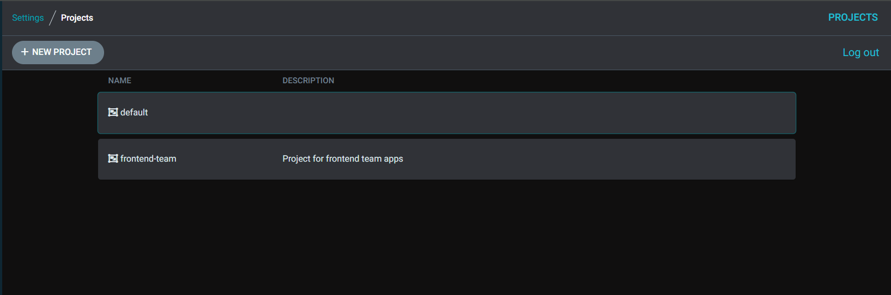
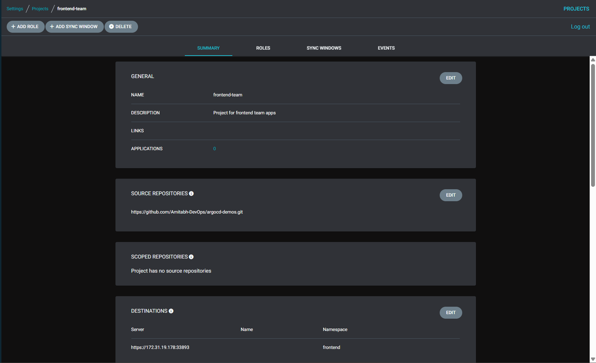
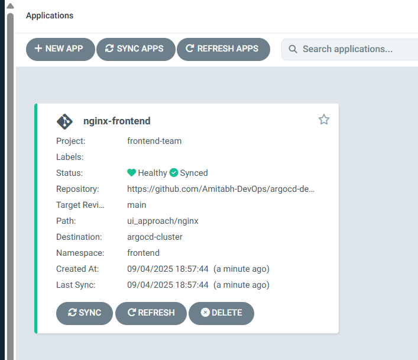
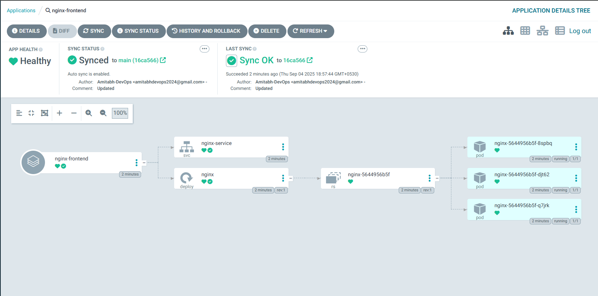
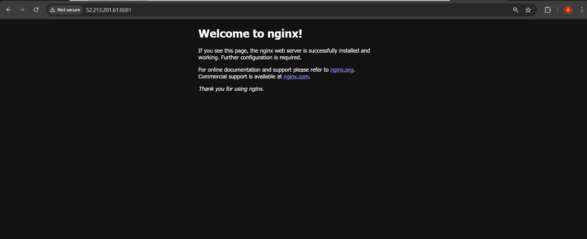

# ArgoCD Projects (Multi-Team Isolation + RBAC)

In this section, we’ll explore **ArgoCD Projects**, which allow us to logically group applications and enforce access controls.  

---

## All about ArgoCD Projects

### Projects

Projects provide a logical grouping of applications, which is useful when Argo CD is used by multiple teams. Projects provide the following features:
  - restrict what may be deployed (trusted Git source repositories)
  - restrict where apps may be deployed to (destination clusters and namespaces)
  - restrict what kinds of objects may or may not be deployed (e.g. RBAC, CRDs, DaemonSets, NetworkPolicy etc...)
  - defining project roles to provide application RBAC (bound to OIDC groups and/or JWT tokens)
  - Control sync windows (when apps can/can’t sync).  

- This is essential in multi-team or enterprise setups.

### The Default Project

Every application belongs to a single project. If unspecified, an application belongs to the `default` project, which is created automatically and by default, permits deployments from any source repo, to any cluster, and all resource Kinds. 

The default `project` can be modified, but not deleted. The project is useful for initial testing, but it is recommended to create dedicated projects with explicit source, destination, and resource permissions.

### Project Roles

Projects include a feature called roles that can be used to determine who and what can be done to the applications associated with the project. As an example, it can be used to give a CI pipeline a restricted set of permissions allowing sync operations on a single app (but not change its source or destination).

Projects can have multiple roles, and those roles can have different access granted to them. These permissions are called policies which follows the same RBAC pattern used in Argo CD configuration. They are stored within the role as a list of policy strings. A role's policy can only grant access to that role. Users are associated with roles based on the groups list.

> ✅ Projects = **namespaces for apps** in ArgoCD.  
> ❌ Without Projects, all apps share the same global permissions.  

---

## Steps to Create a new Project

### Prerequisites

* kind cluster running
* An ArgoCD instance up and running.
* `kubectl` and `argocd` CLI configured to interact with your ArgoCD instance.
* Cluster added to ArgoCD server (as we done in chapter 4)

> Follow this to get above things done: [ArgoCD Setup & Installation](../../03_setup_installation/README.md)

---

### 1. Review the Project Manifest

Use: [project.yml](project.yml)

You can remove the comments while trying - using ChatGPT, it is just for your understanding:

> Replace `<your-username>` with your GitHub username.

> Replace `<added_argocd_cluster_server_url>` with the server URL of the cluster you added to ArgoCD (you can find it in ArgoCD UI under Settings → Clusters or by running command `argocd cluster list`).

---

### 2. Apply the Project

```bash
kubectl apply -f project.yml -n argocd
```

---

### 3. Verify in ArgoCD UI

* Navigate to **Settings → Projects**.
* You should see `frontend-team`.

    

* Allowed repos and destinations will be listed.

    

* You can also run:

```bash 
argocd proj list
```

to see the list of projects.

```bash
NAME           DESCRIPTION                     DESTINATIONS                          SOURCES                                             CLUSTER-RESOURCE-WHITELIST  NAMESPACE-RESOURCE-BLACKLIST  SIGNATURE-KEYS  ORPHANED-RESOURCES  DESTINATION-SERVICE-ACCOUNTS
default                                        *,*                                   *                                                   */*                         <none>                        <none>          disabled            <none>
frontend-team  Project for frontend team apps  https://172.31.19.178:33893,frontend  https://github.com/Amitabh-DevOps/argocd-demos.git  */*                         <none>                        <none>          disabled            <none>
```

---

### 4. Create an Application Under the Project

Use: [nginx_app.yml](nginx_app.yml)

You can remove the comments while trying - using ChatGPT, it is just for your understanding:

> Replace `<your-username>` with your GitHub username.

> Replace `<added_argocd_cluster_server_url>` with the server URL of the cluster you added to ArgoCD.

---

### 5. Apply the Application

```bash
kubectl apply -f nginx_app.yml -n argocd
```

---

### 6. Verify

* In ArgoCD UI, `nginx-frontend` will show under **Project: frontend-team**.

    

    

* Run:

```bash
argocd app list
```

You should see the project column populated.

```bash
NAME                   CLUSTER                      NAMESPACE  PROJECT        STATUS  HEALTH   SYNCPOLICY  CONDITIONS  REPO                                                PATH               TARGET
argocd/nginx-frontend  https://172.31.19.178:33893  frontend   frontend-team  Synced  Healthy  Auto-Prune  <none>      https://github.com/Amitabh-DevOps/argocd-demos.git  ui_approach/nginx  main
```


### Access the Nginx
* Port-forward the nginx service:

```bash
kubectl port-forward svc/nginx-service -n frontend 8081:80 --address=0.0.0.0 &
```

* Open the inbound rule for port 8081 of your EC2 instance.
* Open → [http://<instance_public_ip>:8081](http://<instance_public_ip>:8081)
* You should see the Nginx welcome page.

    

---

## Key Takeaways

* Projects are like **tenants** in ArgoCD.
* They provide **isolation + governance** for multiple teams.
* Combine Projects with **RBAC policies** for enterprise setups.

For more details about Project Read here: [ArgoCD Projects](https://argo-cd.readthedocs.io/en/stable/user-guide/projects/)

---

Happy Learning!
