# Chapter 6: ArgoCD Notifications

ArgoCD Notifications provide a way to automatically send alerts about application events (sync, health, errors) to external channels like **Slack, Microsoft Teams, Email, Webhooks, etc.**.  This makes GitOps workflows observable and actionable.

---

## 1. Introduction & Overview

* ArgoCD Notifications is a **built-in component** of ArgoCD since v1.7+.
* It consists of:

  * **Notification Controller**: watches ArgoCD Applications and triggers notifications.
  * **Triggers**: define *when* to send (e.g., on sync failure).
  * **Templates**: define *what* to send (message content).
  * **Subscriptions**: define *where* to send (Slack, Email, etc.).

* Common use cases:

  * Send an **email when an Application fails to sync**.
  * Post a **Slack message when sync succeeds**.

---

## 2. Prerequisites

* Kind cluster running
* ArgoCD Server installed & and running on browser .
* ArgoCD CLI Installed and Logged In.
* Access to an **SMTP server** (Gmail, AWS SES, SendGrid, etc.) for sending email.
    * We will use Gmail, so Create **App Password** in your Gmail account
        * For that Watch this video: [App Password Video](https://youtu.be/s-7DBjS3XRg) & save that app password.

        * Or follow these steps:

            1. Make sure **2-Step Verification** is turned **ON** for the Google account you’ll use. *(App passwords require 2-step verification.)*
              [Google Help](https://myaccount.google.com/security)

                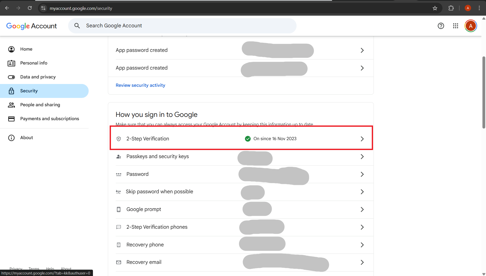

            2. Open **Google Account → Security → App passwords** (or go to [https://myaccount.google.com/apppasswords](https://myaccount.google.com/apppasswords)). You may be asked to sign in again.

            3. Enter an app name like **ArgoCD SMTP** (this is just a label).

                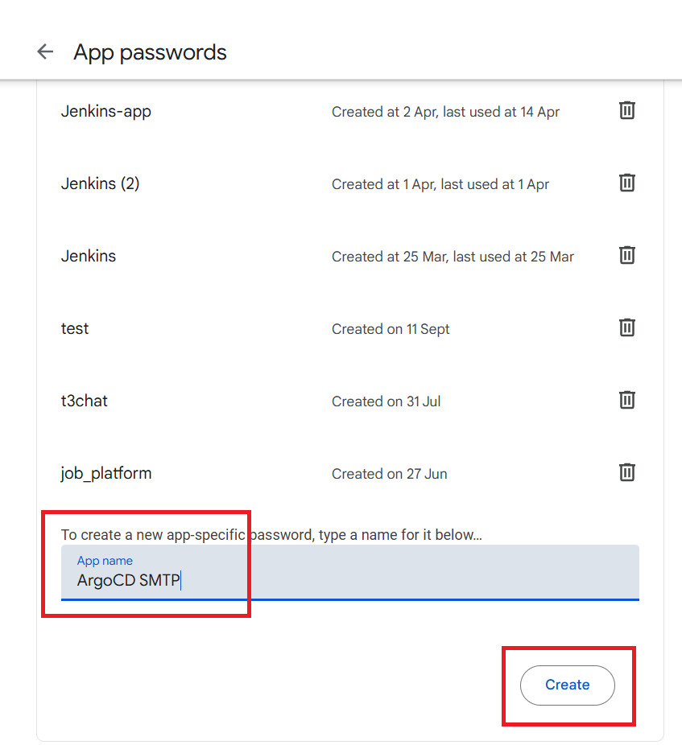

            4. Click **Create**. Google will show a **16-character app password** (format: `xxxx xxxx xxxx xxxx`). **Copy it now — you won’t see it again.**
            
                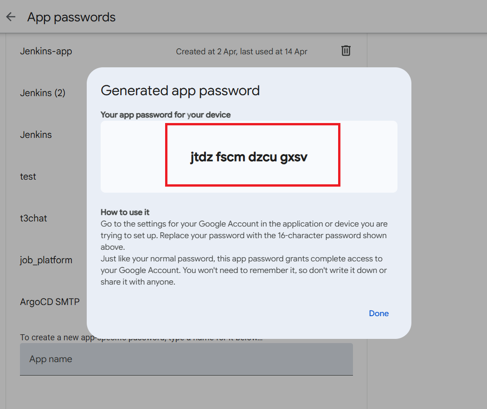
          
          

Follow this to setup ArgoCD & Cluster: [Cluster & ArogCD](../03_setup_installation/README.md)

---

## 3. Setup: Integrating with Email

### Step 0: Install Triggers and Templates from the catalog
```bash
kubectl apply -n argocd -f https://raw.githubusercontent.com/argoproj/argo-cd/stable/notifications_catalog/install.yaml
```

### Step 1: Configure SMTP Secret

Create a Kubernetes Secret with SMTP credentials:

Use: [secret-smtp.yaml](secret-smtp.yaml)

> Replace `your-email@example.com` with your actual sender gmail address (In which you have created app password).

> Replace `your-smtp-password` with your actual app password created in gmail as it is (do not remove spaces between them).


Apply it:

```bash
kubectl apply -f secret-smtp.yaml
```

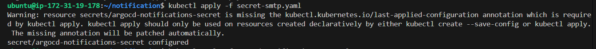

---

### Step 2: Configure Notification ConfigMap

ArgoCD Notifications configuration lives in `argocd-notifications-cm` ConfigMap.

Use: [argocd-notifications-cm.yaml](argocd-notifications-cm.yaml)

> Replace `<your-argocd-server>` with your ArgoCD Server URL basically instance public Ip, where argocd is running.(for getting server url in email notification)

Apply it:

```bash
kubectl apply -f argocd-notifications-cm.yaml
```

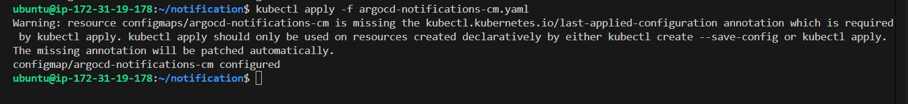

---

###  Secrets and ConfigMap Integration Explained

* **Secret** → stores **sensitive values** (like SMTP username/password).
* **ConfigMap** → stores **configuration logic** (notifiers, triggers, templates).
* When you reference variables like `$email-username` and `$email-password` in the ConfigMap, the Notifications controller automatically substitutes them with values from the `argocd-notifications-secret`.
* This separation ensures:

  * **Security**: credentials stay out of Git (stored in Secret).
  * **Declarative config**: notification logic stays in Git (ConfigMap).
  * **Flexibility**: update SMTP creds by only changing the Secret.

**Flow:**

1. Secret → contains `email-username` and `email-password`.
2. ConfigMap → references them as `$email-username` and `$email-password`.
3. Notifications Controller → resolves these variables at runtime.

👉 Without the `$variable` references in ConfigMap, the controller will not use the Secret automatically — you’d end up hardcoding credentials (not recommended).

---

### Step 3: Update the Application with Notification Subscription

We’ll use our **`chai-app`** Application and annotate it for notifications.

Use: [chai-app.yaml](chai-app.yaml)

> Replace `<receiver@example.com>` with receiver gmail address.

> Replace `<your-username>` with your GitHub Username (The repository you have forked & clonned and has this directory with manifest: `applicationsets/chai-app`)

Apply:

```bash
kubectl apply -f chai-app.yaml
```

* Chai App Status:

    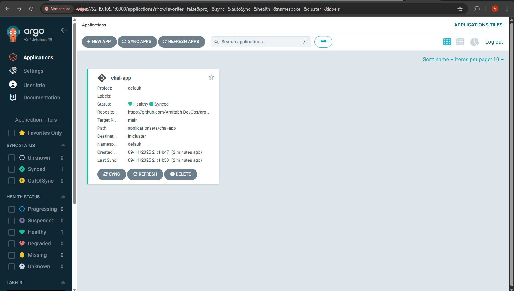

* Chai App Detail:

    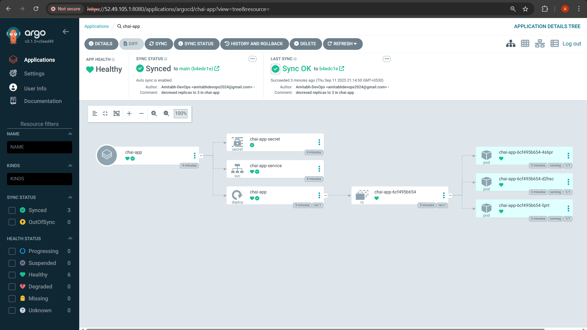

* Forward the `service`(chai-app-service) of `chai-app` and access it in browser:

    ```bash
    kubectl port-forward svc/chai-app-service -n default 3000:3000 --address=0.0.0.0 &
    ```

    Access: [http://<instance_public_ip>:3000](http://<instance_public_ip>:3000)

    

    

---

## 4. Demo: Email Alert for Application Degraded and Application Deployed

1. **Deploy chai-app** (with that annotations).

    * You will recieve success email on deployment success:

      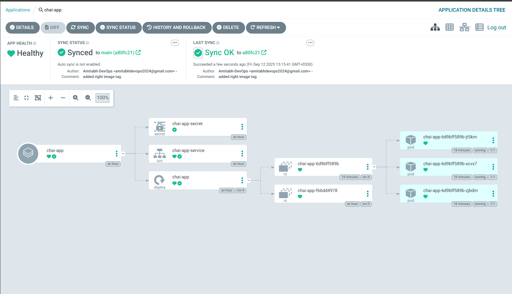

      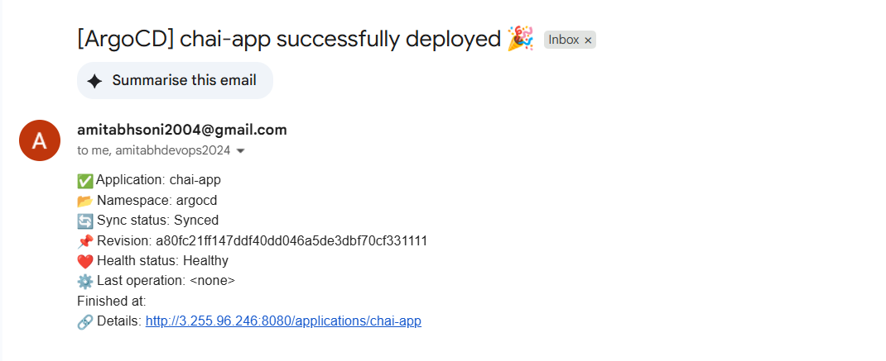


2. **Introduce a failure**:

   * Edit the Git manifest for chai-app (e.g., wrong image tag), like below (the `v1` tag does not exist):

      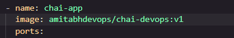

   * Commit & push → ArgoCD App will go in `Degraded` status after sometime (wait for it to become `Degraded` - it will take time).

   * Verify in another terminal by connecting to instance, run:

     ```bash
      kubectl -n argocd logs deploy/argocd-notifications-controller --follow
     ```

      * wait for it to become `ture` (will become true when App health will be `Degraded`, and triggers the email sending):
        
        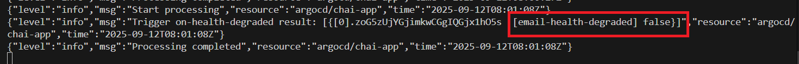

3. **Observe Email**:
   * When app status becomes `Degraded`, email will be sent:

      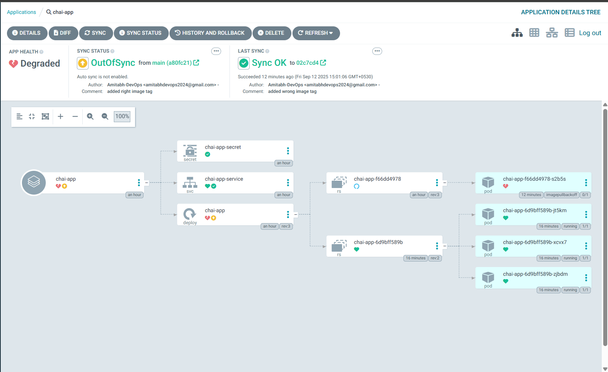

      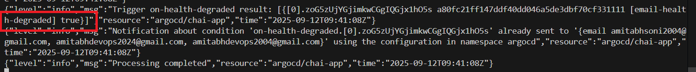

   * Recipient (e.g., `receiver@example.com`) should receive an email with subject:

     ```
     [ArgoCD] chai-app health is Degraded
     ```

    * Email body contains details about the failure.

      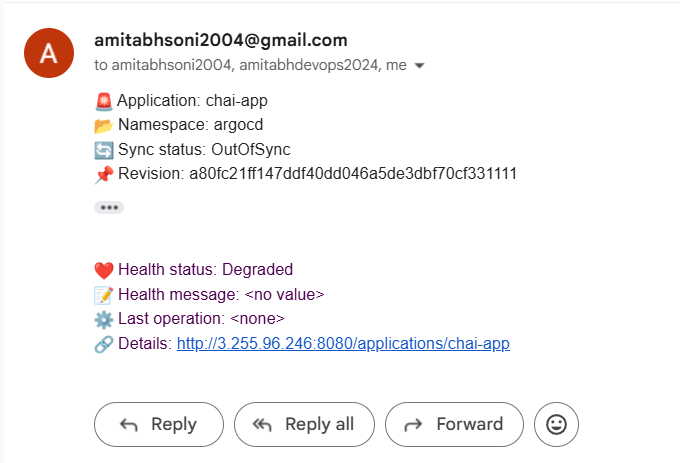

---

## 5. Key Takeaways

* ArgoCD Notifications integrates with Email.
* Configuration requires:

  1. **Secret** (SMTP credentials)
  2. **ConfigMap** (notifiers, triggers, templates)
  3. **Application annotations** (subscriptions)

* Demo: chai-app sends an email alert when app degraded and deployed.

---

## Common ArgoCD Notification Triggers

| **Trigger Name**                      | **Condition**                                          | **When to Use**                                                                                      |
| ------------------------------------- | ------------------------------------------------------ | ---------------------------------------------------------------------------------------------------- |
| `on-sync-status-unknown`              | Application sync status becomes `Unknown`.             | Rare cases when ArgoCD cannot determine sync state; useful for debugging environments.               |
| `on-sync-running`                     | Sync operation has started.                            | Notify teams when a sync begins (e.g., large deployments).                                           |
| `on-sync-succeeded`                   | Sync completed successfully (`Synced`).                | Confirm successful deployments (optional, often used for audit trails or external dashboards).       |
| `on-sync-failed`                      | Sync failed (e.g., invalid manifest, cluster error).   | **Most common** trigger — alert teams immediately when a GitOps deployment fails.                    |
| `on-health-degraded`                  | Application health is reported as `Degraded`.          | Use when app becomes unhealthy (e.g., CrashLoopBackOff pods).                                        |
| `on-deployed`                         | New deployment (sync completed + health is `Healthy`). | Good for post-deploy Slack/email notifications (e.g., “deployment done, all healthy”).               |
| `on-created`                          | Application resource created.                          | Audit trail for when new apps are onboarded to ArgoCD.                                               |
| `on-deleted`                          | Application resource deleted.                          | Alert when an app is removed from ArgoCD (to track intentional vs accidental removals).              |

---

For more READ: [ArgoCD Notifications](https://argo-cd.readthedocs.io/en/stable/operator-manual/notifications/)


Happy Learning!