# Chapter 9: Security & Scaling in ArgoCD

As you start using ArgoCD in production, **security and scalability** become critical. This chapter explains RBAC (role-based access control), local users, SSO with Dex/OIDC, scaling ArgoCD for high availability, and GitOps best practices for enterprises. We'll go step by step, with concepts, examples, and YAML manifests.

---

## Prerequisites

- A running Kubernetes cluster.
- kubectl configured to access the cluster.
- ArgoCD server installed and running.
- argocd CLI installed & Logged in (keep argocd login password, needed to update password).
- Helm 3.x installed.
- Administrative access to your OAuth/OIDC provider (GitHub, Okta, Google, etc.) for SSO setup (we will use GitHub in this guide).

> Use this guide to setup ArgoCD & Kind Cluster [README.mc](../03_setup_installation/README.md) or Run this Shell script [setup_argocd.sh](../03_setup_installation/setup_argocd.sh)

---

## 1. User Management in ArgoCD

### Built-in Admin User

ArgoCD comes with **one built-in admin user** that has full system access. According to official documentation:
- Use the admin user **only for initial configuration**
- **Disable admin user** after creating additional users for security
- Switch to local users or configure SSO integration

### Local Users vs SSO

**Local users** serve two main use cases:
1. **API automation** - Generate tokens for CI/CD pipelines
2. **Small teams** - When SSO might be overkill

**SSO** is recommended for:
- **Enterprise environments** with existing identity providers
- **Advanced features** like groups, login history, centralized management

---

## 2. RBAC in ArgoCD (Role-Based Access Control)

### What is RBAC?

RBAC controls **who** (users/groups) can perform **what actions** on **which resources**. ArgoCD RBAC is defined in the `argocd-rbac-cm` ConfigMap.

### RBAC Components

- **Role** → Named set of permissions (e.g., `role:readonly`)
- **Policy** → Maps roles to allowed/denied actions
- **Subject** → User or group bound to a role

### RBAC Model Structure

ArgoCD uses **Casbin** syntax with two types:

**Group Assignment:**
```
g, <user/group>, <role>
```

**Policy Assignment:**
```
p, <role/user/group>, <resource>, <action>, <object>, <effect>
```

### Available Resources and Actions

Below is a table that summarizes all possible resources and which actions are valid for each of them.

| Resource\Action        | get | create | update | delete | sync | action | override | invoke |
|----------------|:---:|:------:|:------:|:------:|:----:|:------:|:--------:|:------:|
| applications   | ✅  |   ✅   |   ✅   |   ✅   |  ✅  |   ✅   |    ✅    |   ❌   |
| applicationsets| ✅  |   ✅   |   ✅   |   ✅   |  ❌  |   ❌   |    ❌    |   ❌   |
| clusters       | ✅  |   ✅   |   ✅   |   ✅   |  ❌  |   ❌   |    ❌    |   ❌   |
| projects       | ✅  |   ✅   |   ✅   |   ✅   |  ❌  |   ❌   |    ❌    |   ❌   |
| repositories   | ✅  |   ✅   |   ✅   |   ✅   |  ❌  |   ❌   |    ❌    |   ❌   |
| accounts       | ✅  |   ❌   |   ✅   |   ❌   |  ❌  |   ❌   |    ❌    |   ❌   |
| certificates   | ✅  |   ✅   |   ❌   |   ✅   |  ❌  |   ❌   |    ❌    |   ❌   |
| gpgkeys        | ✅  |   ✅   |   ❌   |   ✅   |  ❌  |   ❌   |    ❌    |   ❌   |
| logs           | ✅  |   ❌   |   ❌   |   ❌   |  ❌  |   ❌   |    ❌    |   ❌   |
| exec           | ❌  |   ✅   |   ❌   |   ❌   |  ❌  |   ❌   |    ❌    |   ❌   |
| extensions     | ❌  |   ❌   |   ❌   |   ❌   |  ❌  |   ❌   |    ❌    |   ✅   |

### Creating Local Users

Local users are defined in `argocd-cm` ConfigMap:

Create: [argocd-user-cm.yaml](argocd-user-cm.yaml)

**User Capabilities:**
- `apiKey` - Generate authentication tokens for API access
- `login` - Login using the UI

### Hands-On: Create Local Users

> [!NOTE]
>
> Firstly Update the Password of your current logged in user in ArgoCD i.e `admin`:
>
> ```bash
> argocd account update-password --current-password <current-password> --new-password <new-password>
> ```
>
> You can even do it by ArgoCD UI in `User Info`.
>
> After updating password, Log In to ArgoCD UI using new password for `admin`.
>

* Create local users in `argocd-cm`, Apply: 

  ```bash
  kubectl apply -f argocd-user-cm.yaml
  ```

  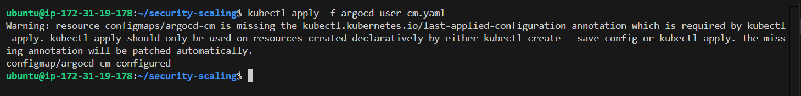

* Set passwords for users:

  ```bash
  argocd account update-password --account alice
  argocd account update-password --account bob
  ```
  
  > You need to pick a password that:
  >  * Is at least 8 characters long
  >  * No more than 32 characters
  >
  >
  > I kept Password as: For alice: alice123, For bob: bob12345
  >

  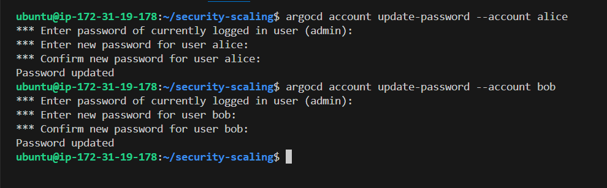


* List all users:

  ```bash
  argocd account list
  ```

  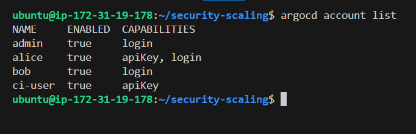

* Get specific user details:

  ```bash
  argocd account get --account alice
  ```

  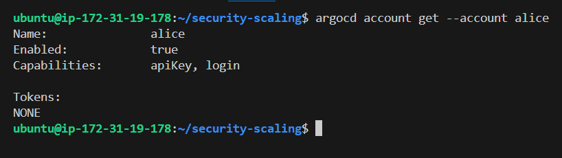

* For Now Open the ArgoCD Server Url (http:<instance_public_ip>:8080) into `Incognito` mode, and try to login as `alice`.
  1. Username: `alice`
  2. Password: `alice123` (or whatever you set)
    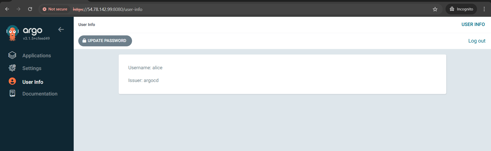


  > You can also login as `bob`.
  >
  > This is how we create new `local` user.

* If needed, you can disabled `admin` user, using: 

  ```bash
  kubectl patch -n argocd configmap argocd-cm --patch='{"data":{"admin.enabled": "false"}}'
  ```

* Similarly, You can enable `admin` user, using:

  ```bash
  kubectl patch -n argocd configmap argocd-cm --patch='{"data":{"admin.enabled": "false"}}'
  ```

### Example RBAC Policy

```yaml
apiVersion: v1
kind: ConfigMap
metadata:
  name: argocd-rbac-cm
  namespace: argocd
data:
  policy.csv: |
    # Built-in roles
    p, role:readonly, applications, get, */*, allow
    p, role:readonly, applications, sync, */*, deny
    p, role:admin, applications, *, */*, allow

    # Custom roles
    p, role:developer, applications, get, myproject/*, allow
    p, role:developer, applications, sync, myproject/*, allow

    # Bind users to roles
    g, alice, role:readonly
    g, bob, role:admin
    g, my-org:dev-team, role:developer  # SSO group

  # Default role for authenticated users
  policy.default: role:readonly
  
  # Control which scopes to examine for RBAC
  scopes: '[groups, email]'
```

### Hands-On: Configure RBAC

Create: [argocd-rbac-cm.yaml](argocd-rbac-cm.yaml)

* Apply RBAC configuration
  ```bash
  kubectl apply -f argocd-rbac-cm.yaml
  ```

  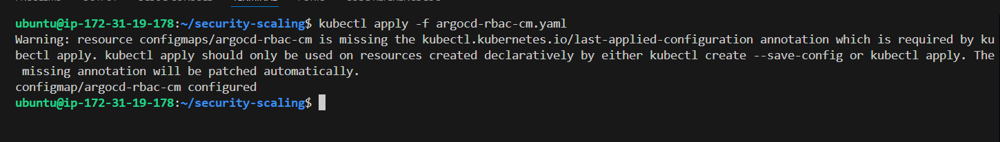

* Validate RBAC configuration

  ```bash
  argocd admin settings rbac validate --policy-file argocd-rbac-cm.yaml
  ```

  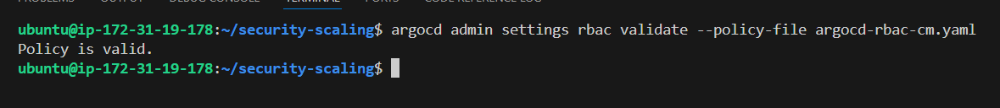

* Check specific user permissions
  * Check, whether user `alice` can get application or not:

    ```bash
    argocd admin settings rbac can alice get applications "myproject/*" -n argocd
    ```

    Yes `alice` can get application:
      
      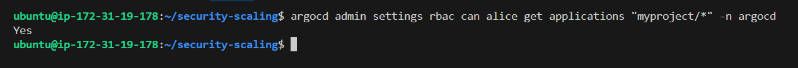

  * Check whether `alice` can sync application or not:

    ```bash
    argocd admin settings rbac can alice sync applications "myproject/*" -n argocd
    ```

    Yes `alice` can sync application, as we defined in `rbac`:

      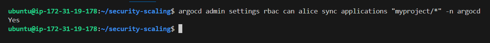
  
  * Check whether `alice` can delete application or not (`alice` don't have delete permission)

    ```bash
    argocd admin settings rbac can alice delete applications "myproject/*" -n argocd
    ```

    No `alice` can't delete application:

      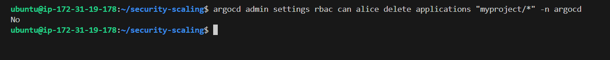

  * Check whether `bob` can sync & delete application or not:

    ```bash
    argocd admin settings rbac can bob sync applications "*" -n argocd
    argocd admin settings rbac can bob delete applications "*" -n argocd
    ```

    Yes `bob` can sync & delete application:

      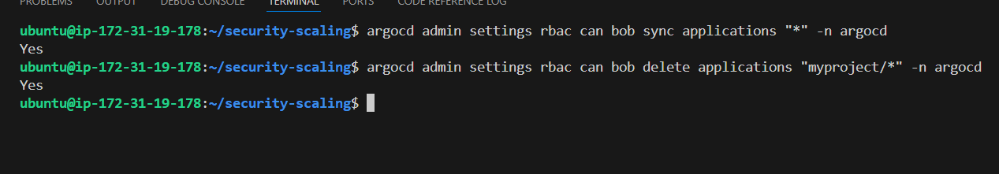

    > Why `Yes`:
    > Because in our RBAC policy, we assigned `bob` to `role:admin`, which has all permissions (`*`).

* You can even verify in ArgoCD UI, by login with both `alice` & `bob`:

  * As `alice` you can only see (get) applications, you can not even add a repository, or create app.
  * As `bob` you can do anything with applications only, as `bob` has admin role. and admin has full permissions to Application resource


**Best Practices:**
- Use `policy.default: role:readonly` for security
- Assign minimum required privileges
- Use groups instead of individual users when possible

---

## 3. SSO with Dex / OIDC

Read & Try: [SSO](github_sso.md) 

> For this, delete the kind cluster running and & ArgoCD setup, if you use existing setup - that can cause issue in sso setup in that guide. Follow that guide as it is (do not create anything - just follow that).

---

## 4. Scaling ArgoCD for High Availability (HA)

Argo CD is largely stateless. All data is persisted as Kubernetes objects, which in turn is stored in Kubernetes' etcd. Redis is only used as a throw-away cache and can be lost. When lost, it will be rebuilt without loss of service.

A set of [HA manifests](https://github.com/argoproj/argo-cd/tree/stable/manifests/ha) are provided for users who wish to run Argo CD in a highly available manner. This runs more containers, and runs Redis in HA mode.

### Why HA?

- **Prevents single points of failure**
- **Ensures continuous operation**
- **Required for production environments**

### ArgoCD HA Components

- **API Server** - Multiple replicas behind LoadBalancer
- **Repo Server** - Scales horizontally for Git operations  
- **Application Controller** - Supports leader election
- **Redis HA** - High availability caching with Sentinel
- **External Database** - PostgreSQL with replication (optional)

### HA Installation

**Official HA Manifests:**
```bash
kubectl apply -n argocd -f https://raw.githubusercontent.com/argoproj/argo-cd/stable/manifests/ha/install.yaml
```

**Scaling with kubectl:**
```bash
# Scale components manually
kubectl -n argocd scale deployment argocd-server --replicas=3
kubectl -n argocd scale deployment argocd-repo-server --replicas=2
kubectl -n argocd scale statefulset argocd-application-controller --replicas=2
```

### Hands-On: Deploy HA ArgoCD

Make sure your `kind` Cluster is Running and the `ArgoCD` Server is Installed using `Manifests` method not `Helm`, if you installed using HELM, then you will face `crashloopbackoff` error, because there is no Direct method to install `HA` using `Helm`. So delete cluster if you installed using Helm, then again install using Manifests.

* Deploy ArgoCD in HA mode using manifest:

  ```bash
  kubectl apply -n argocd -f https://raw.githubusercontent.com/argoproj/argo-cd/stable/manifests/ha/install.yaml
  ```

* Verify HA deployment

  ```bash
  kubectl get pods -n argocd
  kubectl get svc -n argocd
  ```

  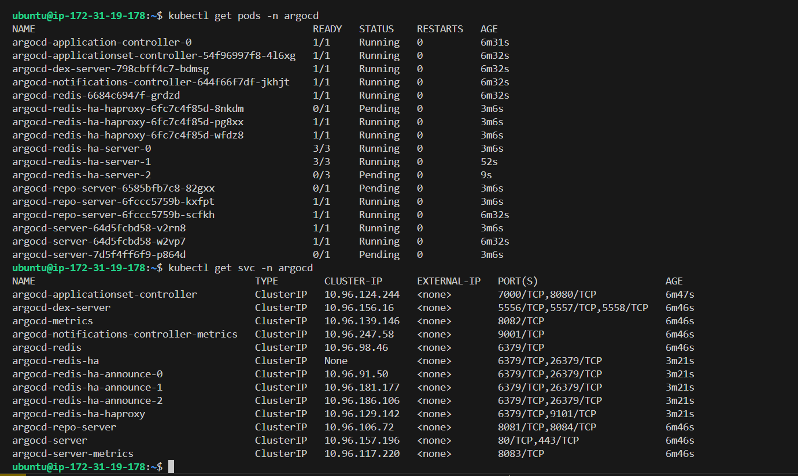

* Check if Redis HA is running

  ```bash
  kubectl get pods -n argocd | grep redis
  ```

  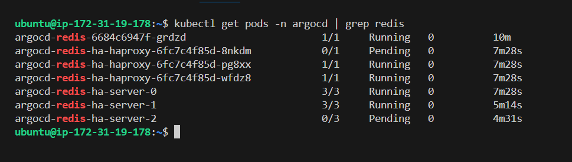

* Scale server replicas

  ```bash
  kubectl -n argocd scale deployment argocd-server --replicas=3
  ```

  > Check using: `kubectl get deployment -n argocd`

* Verify scaling

  ```bash
  kubectl get pods -n argocd -l app.kubernetes.io/name=argocd-server
  ```

**Helm HA Configuration:**

```yaml
controller:
  replicas: 2
server:
  replicas: 3
  autoscaling:
    enabled: true
    minReplicas: 2
    maxReplicas: 5
repoServer:
  replicas: 2
redis-ha:
  enabled: true
```

### HA Best Practices

- **Node Anti-Affinity** - Spread pods across nodes
- **Resource Limits** - Set appropriate CPU/memory limits
- **External Database** - Use managed PostgreSQL for large deployments
- **Load Balancer** - Use proper ingress for the API server

Read more: [High-Availability](https://argo-cd.readthedocs.io/en/latest/operator-manual/high_availability/)

---

## 5. GitOps Best Practices for Enterprises

### Security Practices

- **Use SSO only** - No local passwords in production
- **TLS everywhere** - Secure all communications
- **Secret management** - Use Vault, Sealed Secrets, or External Secrets
- **RBAC with least privilege** - Grant minimum necessary permissions
- **Audit logging** - Enable comprehensive logging

### Scaling Practices

- **AppProjects** - Isolate teams and environments
- **ApplicationSets** - Template applications across clusters
- **Sync waves** - Control deployment order
- **Resource quotas** - Prevent resource contention
- **Multi-cluster** - Separate management and workload clusters

### Operational Practices

- **Git as single source of truth** - All configurations in Git
- **PR-based workflows** - Enforce code reviews
- **Environment promotion** - dev → staging → prod
- **Monitoring and alerting** - Comprehensive observability (Prometheus, Grafana)
- **Disaster recovery** - Regular backups and tested restore procedures

---

Happy Learning!