# Chapter 10: Argo Rollouts

## Rollout:

A Rollout is Kubernetes workload resource which is equivalent to a Kubernetes Deployment object. It is intended to replace a Deployment object in scenarios when more advanced deployment or progressive delivery functionality is needed. A Rollout provides the following features which a Kubernetes Deployment cannot:
   * blue-green deployments
   * canary deployments
   * integration with ingress controllers and service meshes for advanced traffic routing
   * integration with metric providers for blue-green & canary analysis
   * automated promotion or rollback based on successful or failed metrics

---

## 1. Introduction – What is Argo Rollouts?

* Argo Rollouts is a **Kubernetes controller + CRD** that provides **advanced deployment strategies** beyond the default `Deployment`.
* Supports:

  * **Blue/Green Deployments**
  * **Canary Releases** (with traffic shifting, metrics analysis, manual or automated promotion)

👉 Think of it as an **advanced Deployment** replacement (`Rollout` instead of `Deployment`).

---

## 2. Why Argo Rollouts?

* Native Kubernetes `Deployment` only supports **rolling updates**.
* Argo Rollouts enables **progressive delivery** with:

  * Fine-grained control over **traffic shifting** (step by step).
  * **Automated analysis** (Prometheus, Kayenta, Datadog, etc.).
  * Safe rollback if new version fails.

* Integrates with **service meshes** (Istio, Linkerd) & **ingress controllers** (NGINX, ALB).

---

## 3. Argo Rollouts Architecture:
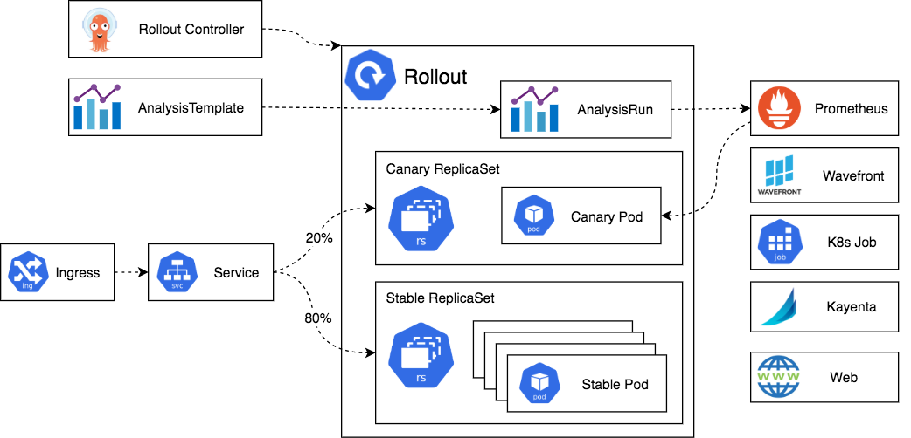

* **Rollouts Controller**: Watches Rollout objects, manages canary/blue-green steps.
* **AnalysisRuns**: Used for metric checks (optional).
* **Services/Ingress**: Handle routing between stable and canary/preview versions.
* **kubectl argo rollouts plugin**: CLI for monitoring rollout status.

---

## 4. Deployment Strategies

### 🔹 Blue/Green Deployment

* Two environments: **Blue (stable)** & **Green (new)**.
* Both versions exist → traffic switched at once after testing.

  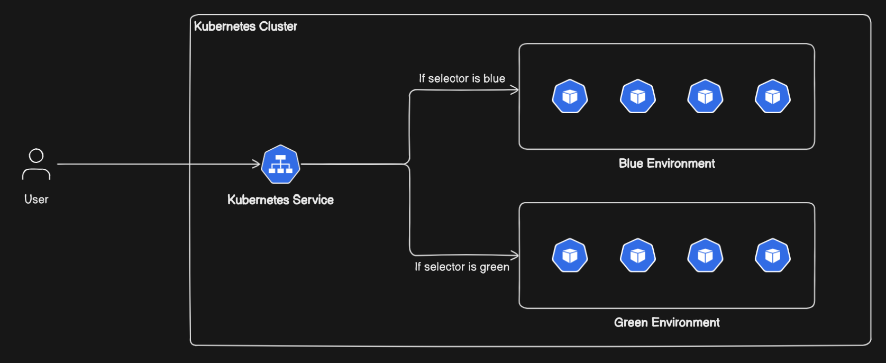

Example flow:

1. Deploy new version (Green).
2. Validate (manual or automated).
3. Switch service traffic from Blue → Green.
4. Rollback = switch back to Blue.

---

### 🔹 Canary Deployment

* Gradually shift traffic from **old → new version** in steps.
* Can include metric checks or manual approvals.

  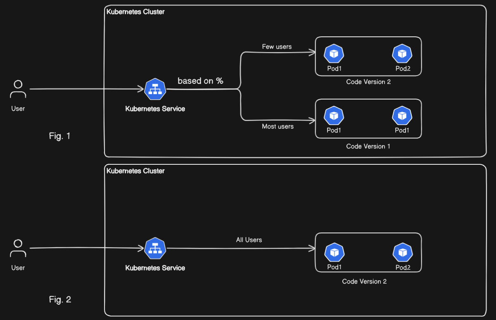

Example flow:

1. Start with 10% traffic → monitor.
2. Increase to 50% → monitor.
3. If stable, promote to 100%.
4. If failure, rollback immediately.

---

## 5. Practical Example

### Prerequisite
* Kubernetes cluster (Minikube, Kind, EKS, etc.).
* `kubectl` installed and configured.

We’ll use **NGINX → Apache**.

### Install Argo Rollouts

```bash
kubectl create namespace argo-rollouts
kubectl apply -n argo-rollouts \
  -f https://github.com/argoproj/argo-rollouts/releases/latest/download/install.yaml
```

Verify:

```bash
kubectl get pods -n argo-rollouts
```

Install plugin For Linux(ubuntu):

```bash
curl -LO https://github.com/argoproj/argo-rollouts/releases/latest/download/kubectl-argo-rollouts-linux-amd64
```

Make it executable and move to PATH:

```bash
chmod +x kubectl-argo-rollouts-linux-amd64
sudo mv kubectl-argo-rollouts-linux-amd64 /usr/local/bin/kubectl-argo-rollouts
```

Verify:

```bash
kubectl argo rollouts version
```

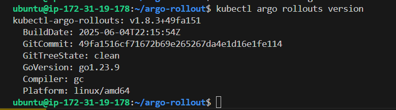

---

### Example 1: Canary Rollout

**rollout-canary.yaml**

Use: [rollout-canary.yaml](rollout-canary.yaml)


Apply:

```bash
kubectl apply -f rollout-canary.yaml
kubectl apply -f nginx-canary-svc.yaml
```

Open new terminal and connect to same instance, then watch rollout:

```bash
kubectl argo rollouts get rollout nginx-canary --watch
```

Check status:

```bash
kubectl argo rollouts get rollout nginx-canary
kubectl get pods -l app=nginx-canary
kubectl get svc nginx-canary-svc
```

Access Nginx-App, forward the port for `nginx-canary-svc`:

```bash
kubectl port-forward svc/nginx-canary-svc 8081:80 --address=0.0.0.0 &
```

Then access at: `http://<instance_public_ip>:8081`


Upgrade image as for `apache` (simulate new version):

```bash
kubectl argo rollouts set image nginx-canary nginx=httpd:2.4
```

Started rollout:


After rollout (You can see the previous version is successfully scale down and new version is running):

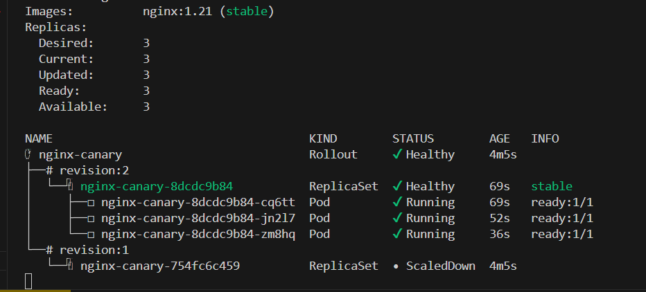

Again make a port-forward for `nginx-canary-svc` and you will see apache:

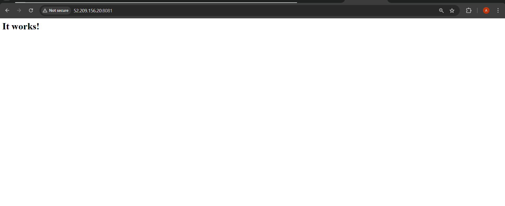

Watch at Argo Dashboard:

```bash
kubectl argo rollouts dashboard &
```

Open the inbound rule for port `3100` and watch at: `http://<instance_public_ip>:3100`:

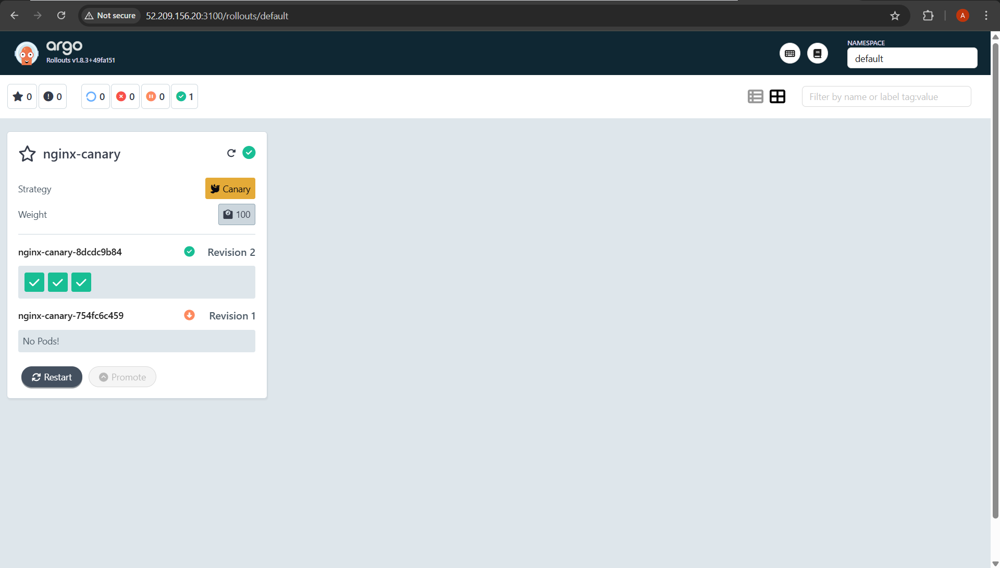

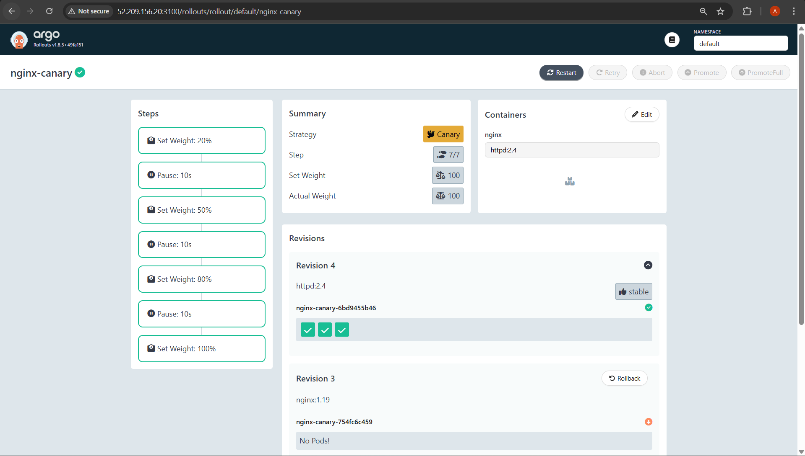

Promote (If rollout paused at a canary step): 

```bash
kubectl argo rollouts promote nginx-canary
```

Rollback (Optional):

```bash
kubectl argo rollouts undo nginx-canary 
```

As you can see if you `undo` rollout then it will use the previous nginx image:

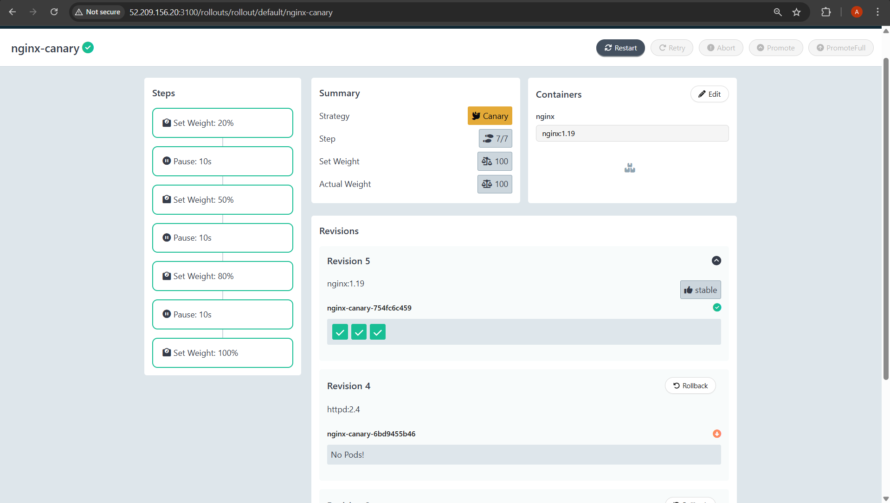


Deleting Rollout
```bash
kubectl delete -f rollout-canary.yaml
kubectl delete -f nginx-canary-svc.yaml
```

---

### Example 2: Blue/Green Rollout

**rollout-bluegreen.yaml**

Use: [rollout-bluegreen.yaml](rollout-bluegreen.yaml)

Services:

Use: [services-bluegreen.yaml](services-bluegreen.yaml)

Apply:

```bash
kubectl apply -f rollout-bluegreen.yaml
kubectl apply -f services-bluegreen.yaml
```

Watch at new terminal connected with instance:

```bash
kubectl argo rollouts get rollout nginx-bluegreen --watch
```

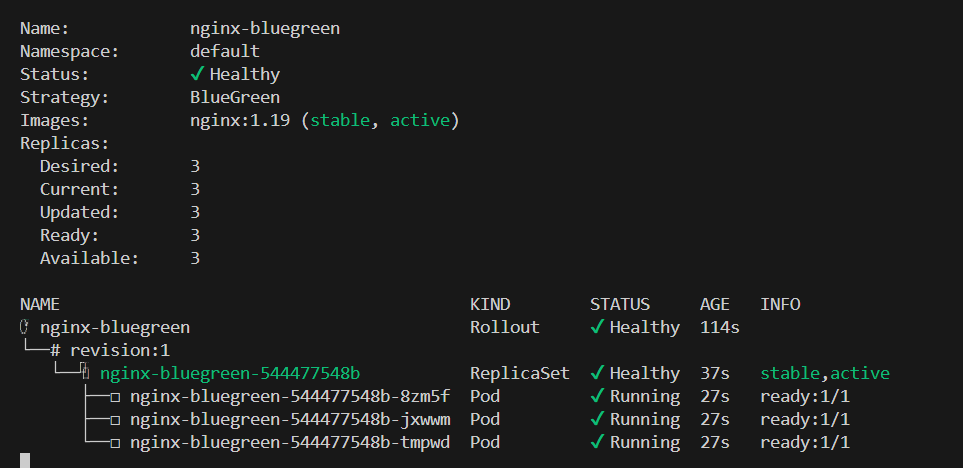

Check status:

```bash
kubectl argo rollouts get rollout nginx-bluegreen
kubectl get pods -l app=nginx-bluegreen
kubectl get svc
```

Watch at Argo Dashboard:

```bash
kubectl argo rollouts dashboard &
```

Open the inbound rule for port `3100` and watch at: `http://<instance_public_ip>:3100`:

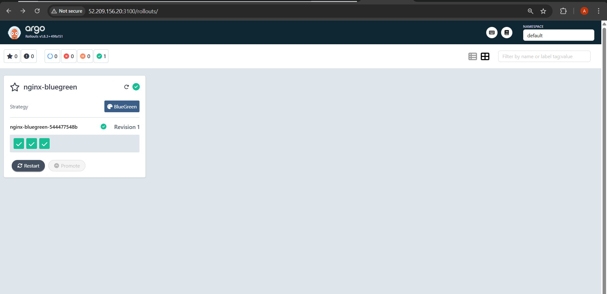


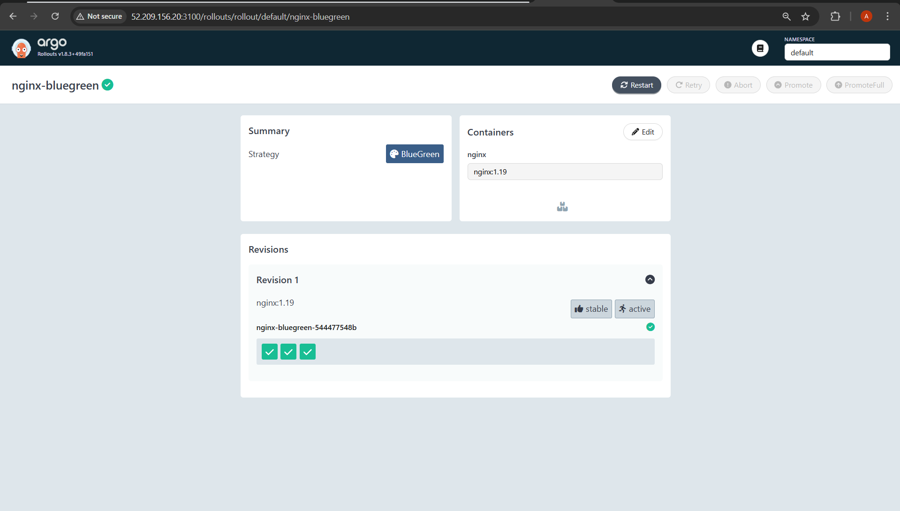


Upgrade image as `apache` (simulate new version):
```bash
kubectl argo rollouts set image nginx-bluegreen nginx=httpd:2.4
```

Preview service will show new version, active stays old.

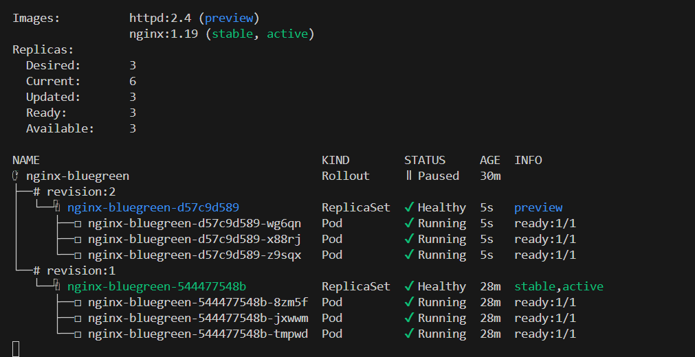

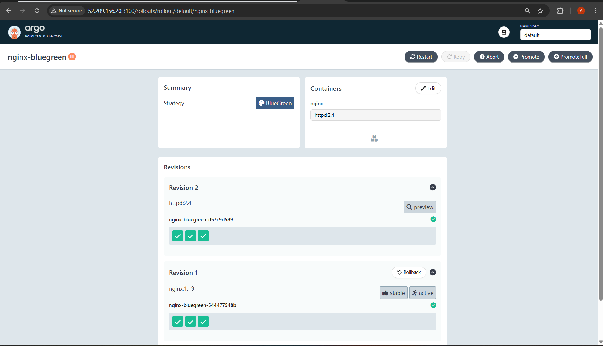

Forward services:
```bash
kubectl port-forward svc/nginx-active 8082:80 --address=0.0.0.0 &
kubectl port-forward svc/nginx-preview 8083:80 --address=0.0.0.0 &
```

Access at:
* Active(Nginx): `http://<instance_public_ip>:8082`

    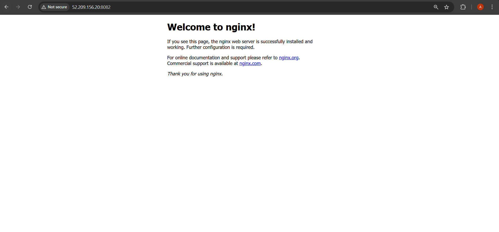

* Preview(Apache): `http://<instance_public_ip>:8083`

    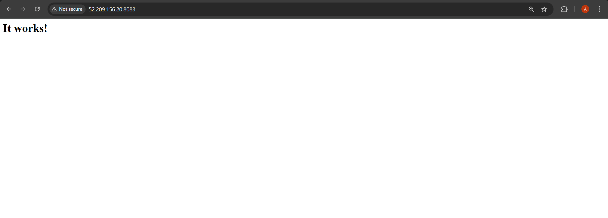


Switch traffic to new version:
```bash
kubectl argo rollouts promote nginx-bluegreen
```

After promote(Apache will become active and nginx go down):

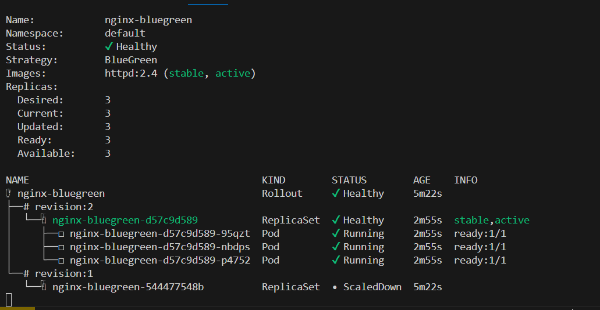

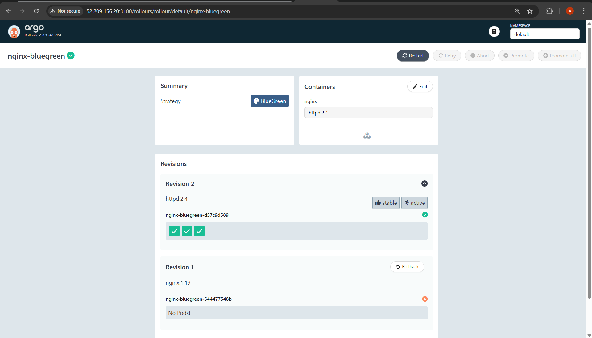

Now both service will show `Apache` Page:

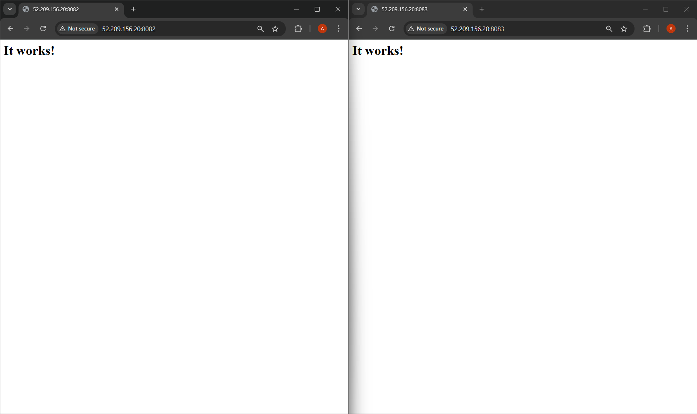

Rollback (Optional):

```bash
kubectl argo rollouts undo nginx-bluegreen 
```

Cleanup:
```bash
kubectl delete -f rollout-bluegreen.yaml
kubectl delete -f services-bluegreen.yaml
```

---

For more info read: [Argo Rollout](https://argoproj.github.io/argo-rollouts/)


Happy Learning!
