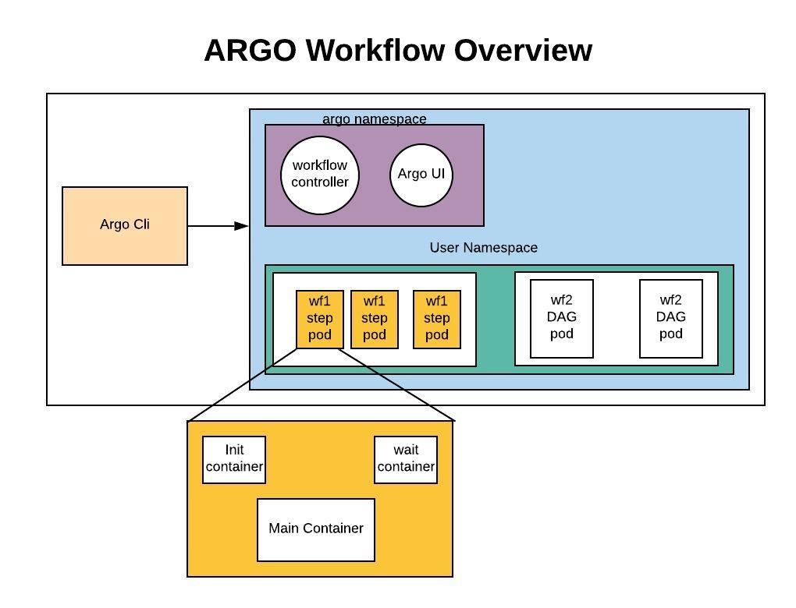
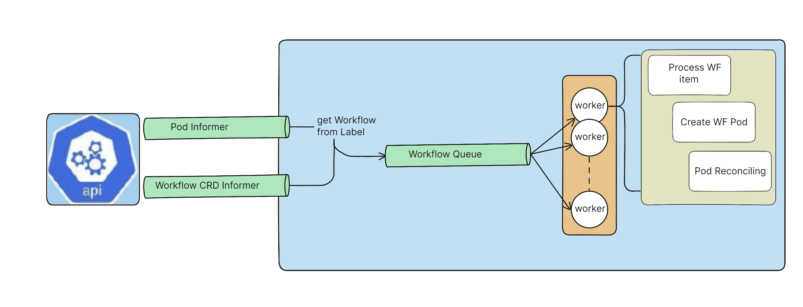

# Chapter 11 — Argo Workflows

## 1. What is Argo Workflows?

* Argo Workflows is an open source container-native workflow engine for orchestrating parallel jobs on Kubernetes. Argo Workflows is implemented as a Kubernetes CRD (Custom Resource Definition).
* Argo Workflows adds a new Kubernetes `Kind: Workflow` that describes a workflow of containers/tasks.
* Workflows are expressed using **templates** (container, script, resource, etc.), **entrypoint**, and either **steps** (sequential stages) or **DAG** (directed acyclic graph - it is a type of graph that consists of nodes (vertices) connected by directed edges (arrows) but with no cycles).
* Workflows can be parameterized, pass outputs between steps, persist artifacts (S3/MinIO), scheduled (CronWorkflow), and templated (WorkflowTemplate/ClusterWorkflowTemplate).
* You interact using the **argo CLI** and a UI served by `argo-server`.

---

## 2. Why Argo Workflows?

* Argo Workflows is the most popular workflow execution engine for Kubernetes.
* Light-weight, scalable, and easier to use.
* Designed from the ground up for containers without the overhead and limitations of legacy VM and server-based environments.
* Cloud agnostic and can run on any Kubernetes cluster.
* Kubernetes-native orchestration: each task runs as a Pod, so you get native scaling, scheduling, and isolation.
* Great for CI/CD pipelines, data processing jobs, ETL pipelines, ML workflows, and periodic jobs.
* Extensible templates, artifact support, retry/backoff, timeouts, and hooks make it production-grade.

### Why do we use Argo Workflows in the real world?

#### 1. **Data & ML Pipelines**

* Orchestrate **ETL jobs** (Extract → Transform → Load).
* Run **machine learning pipelines**:

  * Step 1: preprocess data
  * Step 2: train model
  * Step 3: evaluate model
  * Step 4: push model to registry
* Example: Companies like Spotify and NVIDIA use Argo to run ML workflows.

#### 2. **CI/CD Pipelines**

* Alternative to Jenkins/GitLab CI.
* Build, test, and deploy applications as containerized steps.
* Each step runs in a pod → easy to scale and isolate.

Example:

* Step 1: Run unit tests
* Step 2: Build Docker image
* Step 3: Push to DockerHub/ECR
* Step 4: Deploy to Kubernetes

---

#### 3. **Batch & Parallel Processing**

* Run **large-scale parallel jobs** like:

  * Genome sequencing
  * Financial risk simulations
  * Image/video processing at scale
* Argo Workflows can fan-out thousands of pods to process jobs in parallel, then fan-in results.

---

#### 4. **Event-driven Automation**

* Trigger workflows on Git commits, S3 uploads, or cron schedules.
* Great for **DevOps automation** (backups, cleanup, monitoring tasks).

---

#### 5. **Kubernetes-Native Orchestration**

* Unlike external tools (Airflow, Jenkins, etc.), Argo Workflows is **cloud-native**:

  * Uses CRDs (Custom Resource Definitions) → no extra servers needed.
  * Leverages Kubernetes scaling, RBAC, and namespaces.
  * Easy to monitor with `kubectl` or `argo` CLI.

---

✅ **In short:**
Argo Workflows = *Kubernetes-native workflow engine* → best for **containerized, scalable, event-driven pipelines**.

---

## 3. The Workflow
The `Workflow` is the most important resource in Argo Workflows and serves two important functions:

1. It defines the workflow to be executed.
2. It stores the state of the workflow.

Because of these dual responsibilities, a Workflow should be treated as a "live" object. It is not only a static definition, but is also an "instance" of said definition.

---

## 4. Workflow Spec
The Workflow spec is where you define the desired behavior of your workflow. Key fields include:
* `entrypoint`: The name of the template to execute when the workflow starts.
* `templates`: A list of templates that define the tasks and steps of the workflow.
* `arguments`: Input parameters and artifacts for the workflow.

### `template` Types
* `container`: Runs a container image with specified command and arguments.
* `script`: Runs a script in a specified runtime (e.g., Python, Bash).
* `resource`: Manages Kubernetes resources (create, delete, apply).
* `steps`: Defines a sequence of steps to be executed in order.
* `dag`: Defines a directed acyclic graph of tasks with dependencies.
* `suspend`: Pauses the workflow until manually resumed.
* `plugin`: A Plugin Template allows you to reference an executor plugin.
* `Container Set`: A container set template is similar to a normal container or script template, but allows you to specify multiple containers to run within a single pod.
* `http`: Makes HTTP requests as part of the workflow.

---

## 5. Architecture

Argo Workflows architecture consists of the following main components:
* **Workflow Controller**: The core component that watches for new Workflow resources and manages their execution.
* **Workflow Executor**: Responsible for executing the individual steps of a workflow, typically running as containers in Kubernetes Pods.
* **Artifact Repository**: Stores input and output artifacts for workflows, often using S3-compatible storage.
* **Database**: (Optional) Used to store workflow metadata and state for improved performance and reliability.
* **UI Server**: Provides a web-based interface for visualizing and managing workflows.
* **CLI**: The `argo` command-line tool allows users to interact with Argo Workflows from the terminal.
* **Metrics Server**: (Optional) Collects and exposes metrics for monitoring workflow performance and resource usage.
* **Notification System**: (Optional) Sends notifications based on workflow events, such as completion or failure.
* **Plugins**: Extend the functionality of Argo Workflows with custom executors or other features.
* **Event Listeners**: (Optional) Listen for external events to trigger workflows, enabling event-driven automation.
* **Workflow Archive**: (Optional) Archives completed workflows for long-term storage and auditing.
* **RBAC**: Role-Based Access Control to manage permissions and access to workflows and related resources.
* **Secrets Management**: Integration with Kubernetes Secrets or external secret management systems to securely handle sensitive information.
* **Cron Workflows**: Support for scheduling workflows to run at specified intervals, similar to cron jobs.
* **Workflow Templates**: Reusable workflow definitions that can be instantiated multiple times with different parameters.
* **Cluster Workflow Templates**: Similar to Workflow Templates but available cluster-wide for use in any namespace.
* **Multi-tenancy**: Support for isolating workflows and resources between different teams or users within the same cluster.
* **Argo Events**: An event-driven framework that integrates with Argo Workflows to trigger workflows based on external events.

### Argo Workflow Overview

### Workflow Controller architecture

---

For more detail READ: [Argo Workflow](https://argo-workflows.readthedocs.io/en/latest/)

For Hands-On: [Hands-On](README.md)