# Chapter 11 — Argo Workflows - Hands-On

For Concept of Argo Workflow READ: [CONCEPT.md](CONCEPT.md)

This README is for Hands-On with Argo-Workflow.

---

## Prerequisites

* Kubernetes cluster (minikube / kind / EKS etc.,).
* `kubectl` configured to cluster.

---

## 1. Install Argo Workflows (controller + server) & argo CLI

### Controller & server (quick-start)

Install Controller and Server:

Set the version:
```bash
ARGO_WORKFLOWS_VERSION="v3.7.0"
```

Install:
```bash
kubectl create namespace argo
kubectl apply -n argo -f "https://github.com/argoproj/argo-workflows/releases/download/${ARGO_WORKFLOWS_VERSION}/quick-start-minimal.yaml"
```

### Verify installation

```bash
kubectl get pods -n argo
kubectl get svc -n argo
```

You should see something like:


### Install `argo` CLI for Linux

Create [install_argo.sh](install_argo.sh) and make it executable & run it.

```bash
chmod +x install_argo.sh
./install_argo.sh
```

### Access the UI

Port-forward the argo-server to show the visual UI:

```bash
kubectl -n argo port-forward svc/argo-server 2746:2746 --address=0.0.0.0 &
```

* open inbound rule for port `2746` and then open `https://<instance_public_ip>:2746`.

    > Note: Use `https` not `http`(Navigating to http will result in a server-side error.), Go to advanced option and click on the url.

* The Workflow UI looks like:

    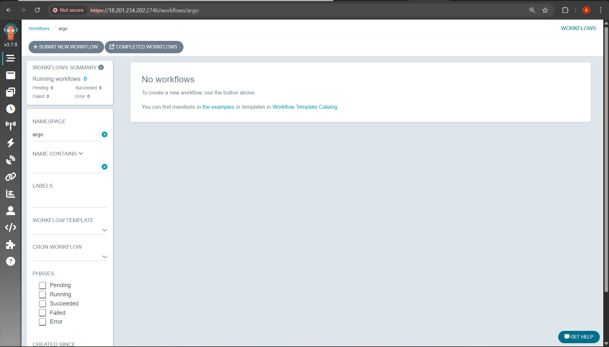

---

## 2. Hands-on examples (manifests + explanations)

---

### 2.1 Hello-World (simple steps style) — `hello-world.yaml`

Use: [hello-world.yaml](manifests/hello-world.yaml)

**What it shows**

* Steps: `generate` runs a Python script that prints a message; its stdout becomes the `result` in `steps.generate.outputs.result`. `print` reads it as a parameter.

**Run**

```bash
argo submit hello-world.yaml -n argo
```

Check logs:
```bash
argo logs -n argo @latest --follow 
```

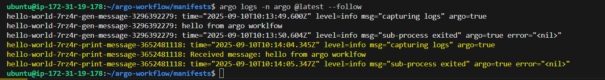

Verify in UI:
* You should see the workflow with steps and logs in the UI.

    * Workflow:

        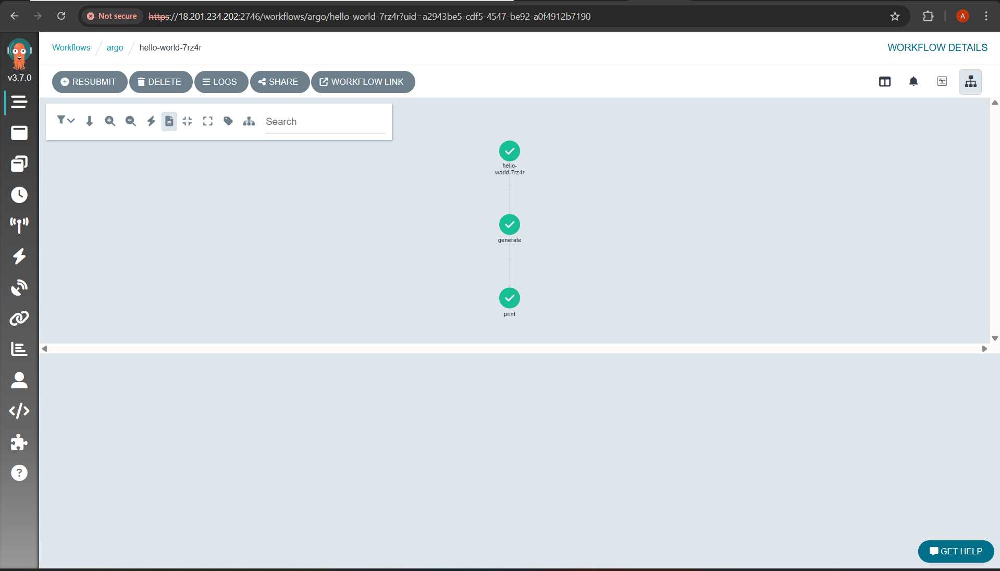

    * logs:

        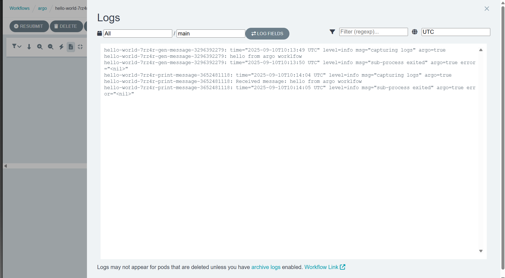

**Cleanup**
```bash
# Deletes the most recently created Argo resource in the 'argo' namespace.
# The '@latest' argument targets the latest resource, and '-n argo' specifies the namespace.
# Use with caution, as this will remove the latest workflow or resource managed by Argo in the specified namespace.

argo delete @latest -n argo   
```

---

### 2.2 DAG example with parameter passing — `dag-example.yaml`

Use: [dag-example.yaml](manifests/dag-example.yaml)

**What it shows**

* A DAG where `step2` depends on `step1`. `step1` writes to a file, which becomes an output parameter; `step2` consumes it. explains dependency graph.

**Run**

```bash
argo submit dag-example.yaml -n argo
```

Check latest workflow:

```bash
argo get @latest -n argo
```

You should see something like:

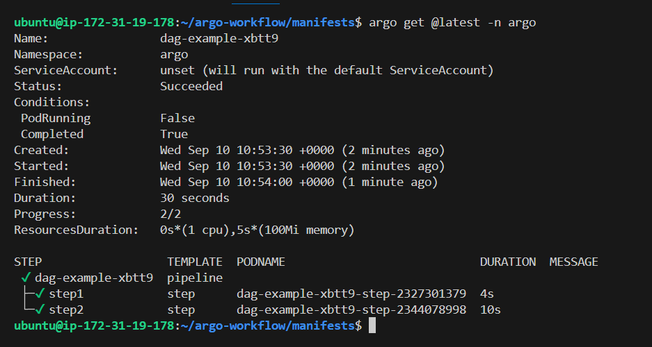


Check Logs:
```bash
argo logs @latest -n argo --follow
```

You should see something like:

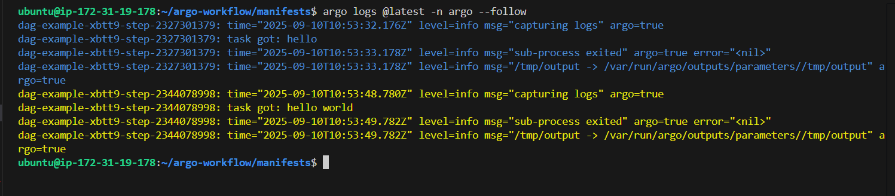


Verify in UI:

* You can click on Second step and see:
    
    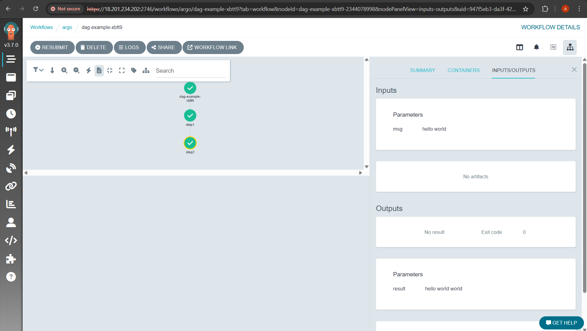


**Cleanup**

```bash
argo delete @latest -n argo   
```

---

### 2.3 WorkflowTemplate (reusable) + submitting by reference — `workflow-template.yaml`

Use: [workflow-template.yaml](manifests/workflow-template.yaml)

**Run**

```bash
kubectl apply -f workflow-template.yaml -n argo
```
This Creates Template, you can see it at `Workflow Templates` in UI:

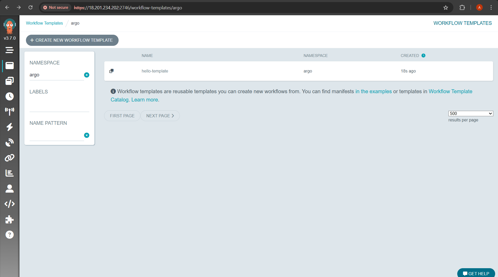

Now submit a workflow that references this template:

```bash
argo submit --from workflowtemplate/hello-template -p who=Dosto -n argo
```

Check logs:
```bash
argo logs @latest -n argo --follow
```

You should see something like:


**What it shows**

* How to package reusable templates in the cluster and submit instances that reference them.

**Cleanup**

```bash
argo delete @latest -n argo
kubectl delete workflowtemplate hello-template -n argo
```

---

### 2.4 CronWorkflow (scheduled) — `cron-workflow.yaml`

Use: [cron-workflow.yaml](manifests/cron-workflow.yaml)

**What it shows**

* How to schedule recurring workflows. Adjust `schedule` according to use. 

**Apply**

```bash
kubectl apply -f cron-workflow.yaml -n argo
```

Check cron workflows:
```bash
kubectl get cronworkflow -n argo
```

Check workflows:
```bash
argo list -n argo
```

Check logs:
```bash
argo logs @latest -n argo --follow
```

Check at argo workflow UI - in `Cron Workflows`:
* It will trigger workflow every minute:
    
    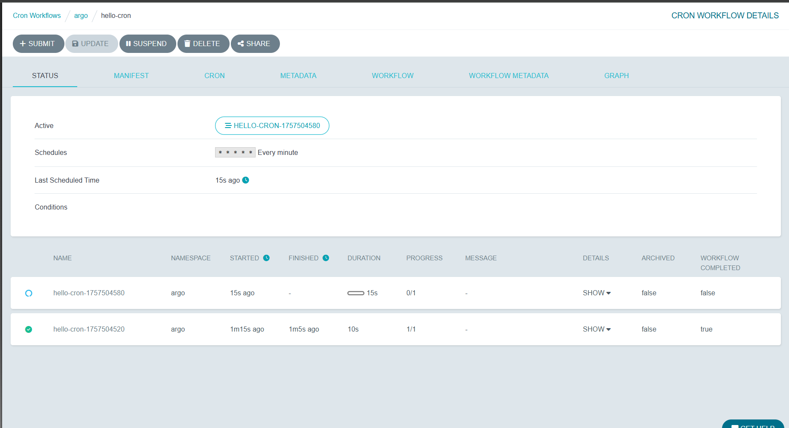

* Output of Workflow:

    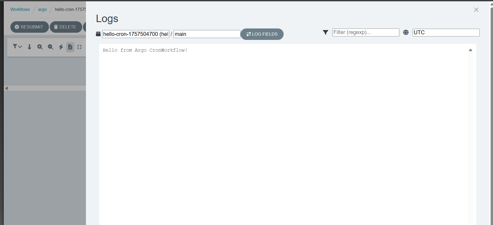

**Cleanup**

```bash
kubectl delete cronworkflow hello-cron -n argo
```
---

### 2.5 Simple CI/CD

Use: [ci-cd.yaml](manifests/simple-ci-cd.yaml)

**What it shows**
* A simple CI/CD pipeline with build, test, and deploy steps.
* It is not real CI/CD, it just shows how we can do it.

**Run**
```bash
argo submit simple-ci-cd.yaml -n argo
```

Check logs:
```bash
argo logs @latest -n argo --follow
```

You should see something like:

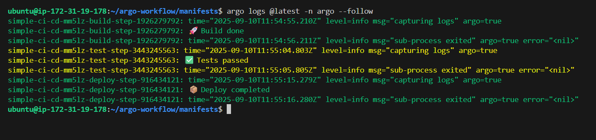


Verify in UI:

* You should see the workflow with steps and logs in the UI.

    * Workflow:

        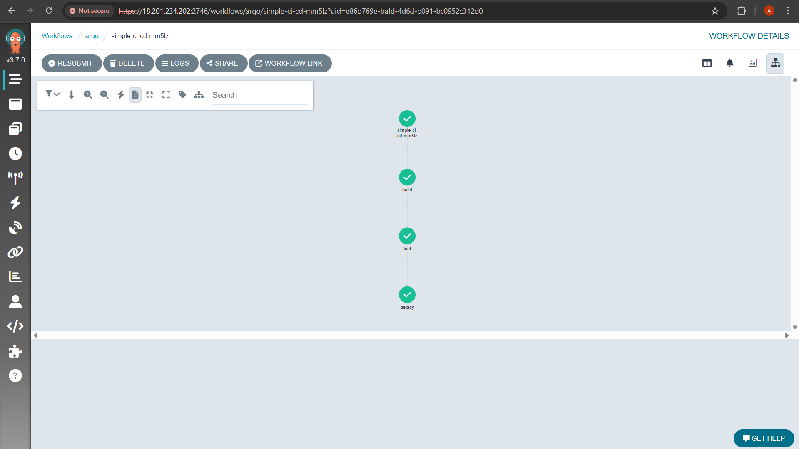

    * logs:

        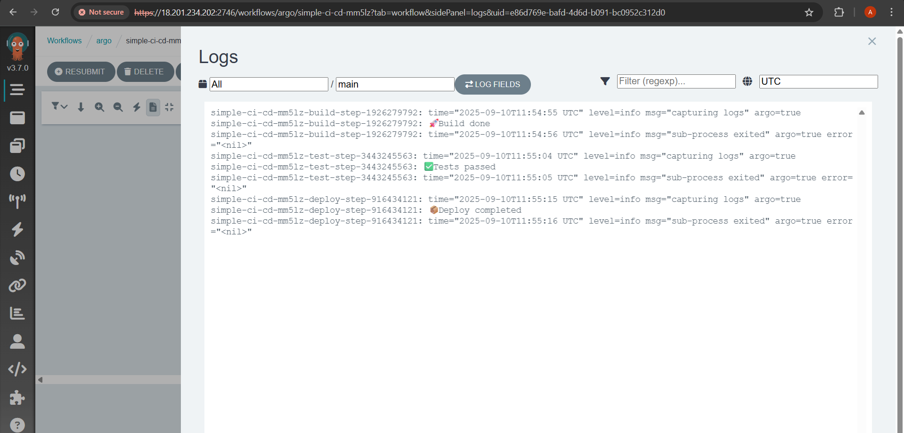


**Cleanup**

```bash
argo delete @latest -n argo   
```

---

## 3. Useful CLI commands

```bash
# submit a workflow YAML
argo submit <workflow-yaml-file> -n argo

# list workflows
argo list -n argo

# get workflow details
argo get <workflow-name> -n argo

# stream logs from a workflow
argo logs <workflow-name> -n argo --follow

# watch a workflow
argo watch <workflow-name> -n argo

# delete a workflow
argo delete <workflow-name> -n argo

# stop / terminate a running workflow
argo stop <workflow-name> -n argo

# suspend (pauses a workflow)
argo suspend <workflow-name> -n argo

# resume (unpause)
argo resume <workflow-name> -n argo

# retry failed workflow
argo retry <workflow-name> -n argo

# delete workflow
argo delete <workflow-name> -n argo

# list cron workflows
kubectl get cronworkflow -n argo

# Delete all workflows
argo delete --all -n argo

# Delete all cron workflows
kubectl delete cronworkflow --all -n argo
```

---

## 4. Best practices

* Use **WorkflowTemplates** for reusable steps.
* Use **parameters** not environment variables for portability.
* Prefer **small containers** that do one job and exit fast.
* Use **timeouts, retries, and backoff** for robustness.
* For sensitive artifacts/credentials, use Kubernetes Secrets + IAM roles where available.
* For production use, install with production manifests/Helm and configure persistence (Postgres) and HA.

---

Happy Learning!