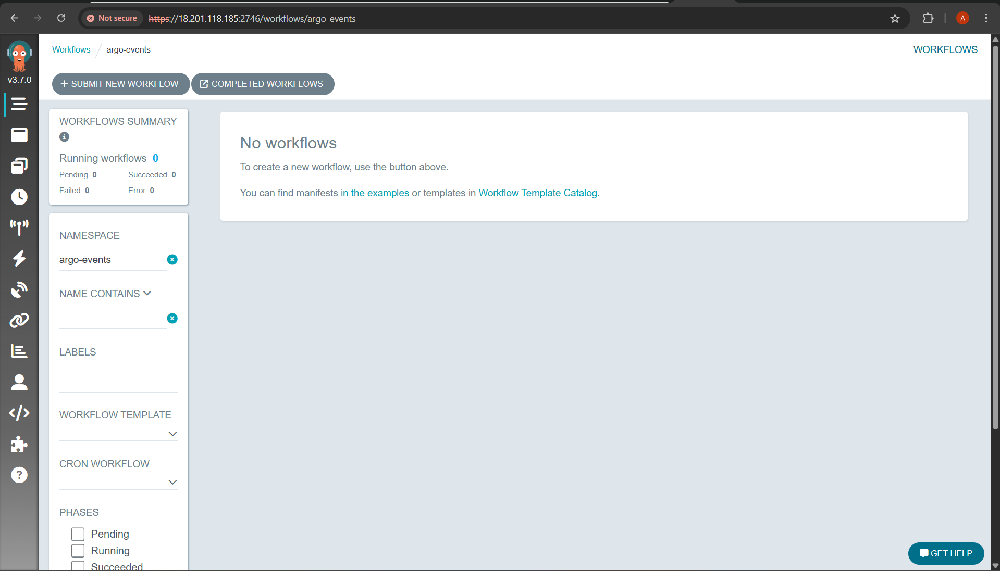
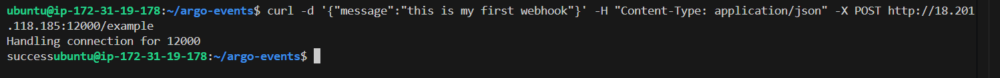
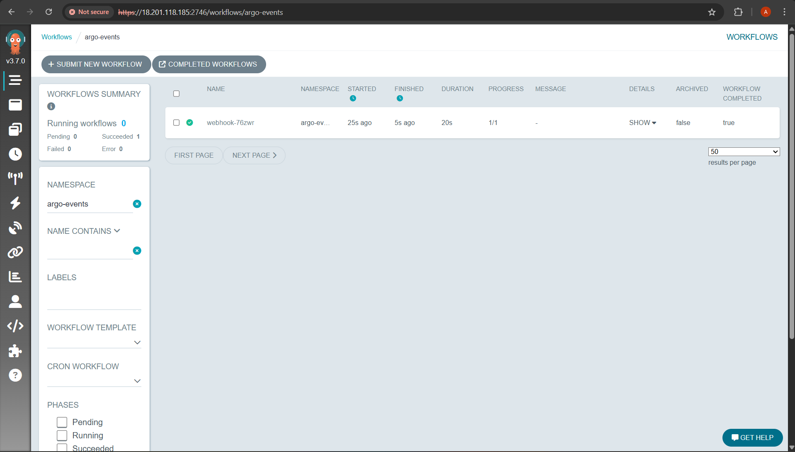
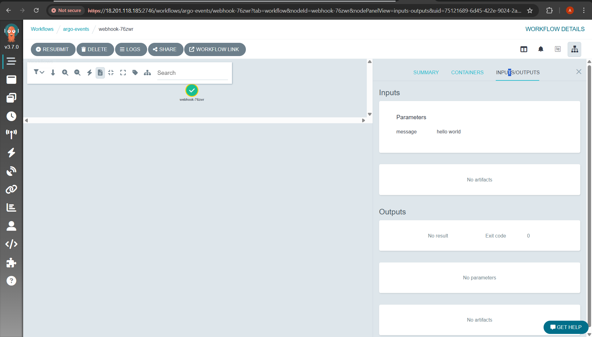
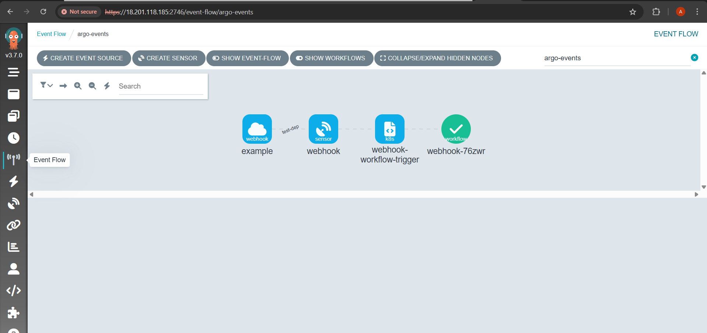
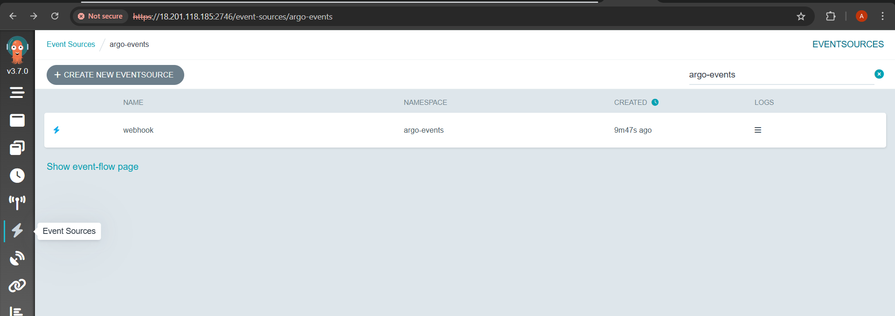
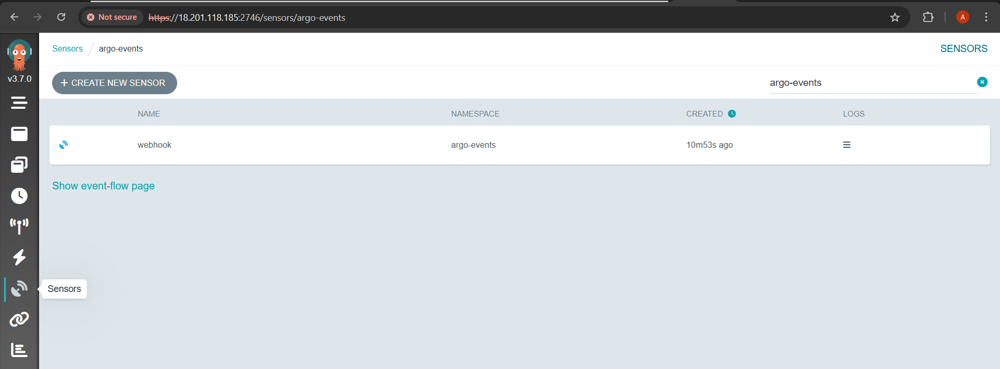

# Chapter 12 - Argo Events

Argo Events is an event-driven workflow automation framework for Kubernetes which helps you trigger K8s objects, Argo Workflows, Serverless workloads, etc. on events from a variety of sources like webhooks, S3, schedules, messaging queues, gcp pubsub, sns, sqs, etc.

## TL;DR

Argo Events converts external happenings (webhooks, schedules, registry notifications) into actions in Kubernetes. In this chapter we focus on a single, powerful example: **using a webhook EventSource and Sensor to start an Argo Workflow**. This shows how Argo Events can launch pipelines in response to external events.

---

## Prerequisites

* Kubernetes cluster (minikube / kind / cloud).
* `kubectl` configured to target the cluster.

### 1. Install Argo Workflows (controller + server) & argo CLI

#### Controller & server (quick-start)

Set the version:

```bash
ARGO_WORKFLOWS_VERSION="v3.7.0"
```

Install:

```bash
kubectl create namespace argo
kubectl apply -n argo -f "https://github.com/argoproj/argo-workflows/releases/download/${ARGO_WORKFLOWS_VERSION}/quick-start-minimal.yaml"
```

#### Verify installation

```bash
kubectl get pods -n argo
kubectl get svc -n argo
```

You should see controller and server pods running.

#### Install `argo` CLI (Linux)

Create [install\_argo.sh](install_argo.sh), make it executable, and run it:

```bash
chmod +x install_argo.sh
./install_argo.sh
```

#### Access the UI

Port-forward the argo-server:

```bash
kubectl -n argo port-forward svc/argo-server 2746:2746 --address=0.0.0.0 &
```

Open `https://<instance_public_ip>:2746` in a browser (allow inbound rule for port `2746`). Use **https**, not http.



---

## Install Argo Events

Create Namespace:
```bash
kubectl create namespace argo-events
```

Deploy Argo Events SA, ClusterRoles, and Controller for Sensor, EventBus, and EventSource.

```bash
kubectl apply -f https://raw.githubusercontent.com/argoproj/argo-events/stable/manifests/install.yaml
# Install with a validating admission controller
kubectl apply -f https://raw.githubusercontent.com/argoproj/argo-events/stable/manifests/install-validating-webhook.yaml
```

Deploy the eventbus.
```bash
kubectl apply -n argo-events -f https://raw.githubusercontent.com/argoproj/argo-events/stable/examples/eventbus/native.yaml
```

Verify:

```bash
kubectl get all -n argo-events
```

---

## Example - Webhook → start Argo Workflow

**Goal:** Demonstrate using a webhook EventSource and a Sensor that creates an Argo Workflow CRD.

### Setup event-source for webhook

1. Create event-source.

    Use: [event-source.yaml](event-source.yaml)

    Apply:
    ```bash
    kubectl apply -f event-source.yaml
    ```

    The above event-source contains a single event configuration that runs an HTTP server on port `12000` with endpoint `example`.

After running the above command, the event-source controller will create a pod and service.

1. Create a service account with RBAC settings to allow the sensor to trigger workflows, and allow workflows to function.

    ```bash
    # sensor rbac
    kubectl apply -n argo-events -f https://raw.githubusercontent.com/argoproj/argo-events/master/examples/rbac/sensor-rbac.yaml
    # workflow rbac
    kubectl apply -n argo-events -f https://raw.githubusercontent.com/argoproj/argo-events/master/examples/rbac/workflow-rbac.yaml
    ```

2. Create webhook sensor.

    Use: [webhook-sensor.yaml](webhook-sensor.yaml)

    ```bash
    kubectl apply -f webhook-sensor.yaml
    ```

Once the sensor object is created, sensor controller will create corresponding pod and a service.

Verify:

```bash
kubectl get pods -n argo-events
kubectl get svc -n argo-events
kubectl get eventsources -n argo-events
kubectl get sensors -n argo-events
kubectl describe sensors webhook -n argo-events
kubectl describe eventsources webhook -n argo-events
```


1. Expose the event-source pod via Ingress, OpenShift Route or port forward to consume requests over HTTP.

    ```bash
    kubectl -n argo-events port-forward svc/webhook-eventsource-svc 12000:12000 --address=0.0.0.0 &
    ```

    > Open the inbound rule for port `12000`.

2. Use either Curl or Postman to send a post request to the http://<instance_public_ip>:12000/example.

    ```bash
    curl -d '{"message":"this is my first webhook"}' -H "Content-Type: application/json" -X POST http://<instance_public_ip>:12000/example
    ```

    > Replace `<instance_public_ip>` with your actual instance public ip.

    

You can see that workflow got triggered and completed in your Argo-workflow in `argo-events` namespace.



3. Verify the workflow is created and running:
    ```bash
    kubectl get wf -n argo-events
    kubectl describe wf <workflow_name> -n argo-events
    ```

4. View logs of the workflow pod:
    ```bash
    kubectl logs -l workflows.argoproj.io/workflow=<workflow_name> -n argo-events
    ```

5. Using the UI:
   Open the Argo Workflows UI (`https://<instance_public_ip>:2746`) and observe the workflow execution graphically.

    * Workflow Output:

        
    
    * Event Flow:

        

    * Event Source:

        

    * Sensor:

        
    
---

## References

* [Argo Events documentation](https://argoproj.github.io/argo-events/)
* [Argo Workflows documentation](https://argo-workflows.readthedocs.io/en/latest/)

---

Happy Learning!